<p align="center">

</p>

## Introduction

[EcoTyper](https://ecotyper.stanford.edu/) is a machine learning
framework for large-scale identification of cell type-specific
transcriptional states and their co-association patterns from bulk and
single-cell (scRNA-seq) expression data.

We have already defined cell states and ecotypes across **carcinomas**
([Luca/Steen et al., Cell
2021](https://doi.org/10.1016/j.cell.2021.09.014)) and in **diffuse
large B cell lymphoma (DLBCL)** ([Steen/Luca et al., Cancer Cell
2021](https://doi.org/10.1016/j.ccell.2021.08.011)). The current version
of EcoTyper allows users to recover the cell states and ecotypes for
these two tumor categories in their own data. Additionally, it allows
users to discover and recover cell states and ecotypes in their system
of interest, including **directly** from scRNA-seq data (see [Tutorial
5](#tutorial-5-de-novo-discovery-of-cell-states-and-ecotypes-in-scrna-seq-data)).
Below we illustrate each of these functionalities.

## Citation

If EcoTyper software, data, and/or website are used in your publication,
please cite the following paper(s):

-   [Luca/Steen et al., Cell
    2021](https://doi.org/10.1016/j.cell.2021.09.014) (detailed
    description of EcoTyper and application to carcinomas).
-   [Steen/Luca et al., Cancer Cell
    2021](https://doi.org/10.1016/j.ccell.2021.08.011) (application of
    EcoTyper to lymphoma).

## Setup

The latest version of EcoTyper source code can be found on [EcoTyper
GitHub repository](https://github.com/digitalcytometry/ecotyper) and
[Ecotyper website](https://ecotyper.stanford.edu/). To set up EcoTyper,
please download this folder locally:

``` bash
git clone https://github.com/digitalcytometry/ecotyper
cd ecotyper
```

or:

``` bash
wget https://github.com/digitalcytometry/ecotyper/archive/refs/heads/master.zip
unzip master.zip
cd ecotyper-master
```

### Basic resources

The R packages listed below are required for running EcoTyper. The
version numbers indicate the package versions used for developing and
testing the EcoTyper code. Other R versions might work too:

-   R (v3.6.0 and v4.1.0).
-   R packages: ComplexHeatmap (v2.2.0 and v2.8.0), NMF (v0.21.0 and
    v0.23.0), RColorBrewer (v1.1.2), cluster (v2.1.0 and v2.1.2)),
    circlize (v0.4.10 and v0.4.12), cowplot (v1.1.0 and v1.1.1),
    data.table (base package R v3.6.0 and v4.1.0), doParallel (v1.0.15
    and v1.0.16), ggplot2 (v3.3.2, v3.3.3), grid (base package R v3.6.0
    and v4.1.0), reshape2 (v1.4.4), viridis (v0.5.1 and v0.6.1), config
    (v0.3.1), argparse (v2.0.3), colorspace (v1.4.1 and v2.0.1), plyr
    (v1.8.6).

These packages, together with the other resources pre-stored in the
EcoTyper folder, allow users to:

-   perform the recovery of previously defined cell states and ecotypes
    in their own bulk RNA-seq, microarray and scRNA-seq data (Tutorials
    1 and 2).
-   perform cell state and ecotype discovery in scRNA-seq and pre-sorted
    cell type-specific profiles (Tutorials 5 and 6).

Besides these packages, the additional resources described in the next
section are needed for analyses described in Tutorials 3 and 4.

### Additional resources

For some use cases, such as cell state and ecotype recovery in spatial
transcriptomics assays ([Tutorial
3](#tutorial-3-recovery-of-cell-states-and-ecotypes-in-spatial-transcriptomics-data))
and *de novo* identification of cell states and ecotypes from bulk
expression data ([Tutorial
4](#tutorial-4-de-novo-discovery-of-cell-states-and-ecotypes-in-bulk-data)),
EcoTyper relies on CIBERSORTx ([Newman et al., Nature Biotechnology
2019](https://www.nature.com/articles/s41587-019-0114-2), a digital
cytometry framework for enumerating cell types in bulk data and
performing *in silico* deconvolution of cell type specific expression
profiles. In these situations, the following additional resources are
needed for running EcoTyper:

-   Docker.
-   CIBERSORTx executables than can be downloaded from the [CIBERSORTx
    website](https://cibersortx.stanford.edu/), as Docker images.
    Specifically, EcoTyper requires the **CIBERSORTx Fractions** and
    **CIBERSORTx HiRes** modules. Please follow the instructions on the
    [Download](https://cibersortx.stanford.edu/download.php) section of
    the website to download the Docker images and obtain the Docker
    tokens necessary for running them.

## EcoTyper implementation

EcoTyper is a standalone software, implemented in R (not an R package).
Some of the EcoTyper functions are computationally intensive, especially
for the cell state discovery step described in Tutorials 4-6. Therefore,
EcoTyper is designed as a collection of modular command-line R scripts,
that can be run in parallel on a multi-processor server or a
high-performance cluster. Each script is designed such that its
instances can typically be run on a single core.

We provide wrappers over these scripts that encapsulate the typical
EcoTyper workflows (*Tutorials 1-6*). These wrappers can be run on a
multi-core system, and allow users to discover cell states and ecotypes
in their own bulk, scRNA-seq and FACS-sorted data, as well as recover
previously discovered cell states and ecotypes in bulk tissue expression
profiles, spatial transcriptomics assays, and single-cell RNA-seq data.

## EcoTyper overview

EcoTyper performs two major types of analysis: discovery of cell states
and ecotypes, starting from bulk, scRNA-seq and pre-sorted cell type
specific expression profiles (e.g. FACS-sorted or deconvolved *in
silico*); and recovery of previously defined cell states and ecotypes in
new bulk, scRNA-seq and spatial transcriptomics data.

When the input is bulk data, EcoTyper performs the following major steps
for discovering cell states and ecotypes:

-   *In silico* purification: This step enables imputation of cell
    type-specific gene expression profiles from bulk tissue
    transcriptomes, using CIBERSORTx ([Newman et al., Nature
    Biotechnology
    2019](https://www.nature.com/articles/s41587-019-0114-2)).
-   Cell state discovery: This step enables identification and
    quantitation of cell type-specific transcriptional states.
-   Ecotype discovery: This step enables co-assignment of cell states
    into multicellular communities (ecotypes).

When the input is scRNA-seq or bulk-sorted cell type-specific profiles
(e.g., FACS-purified), EcoTyper performs the following major steps for
discovering cell states and ecotypes:

-   Gene filtering: This step filters out genes that do not show cell
    type specificity.
-   Cell state discovery: This step enables identification and
    quantitation of cell type-specific transcriptional states.
-   Ecotype discovery: This step enables co-assignment of cell states
    into multicellular communities (ecotypes).

Regardless of the input type used for deriving cell states and ecotypes,
EcoTyper can perform cell state and ecotype recovery in external
expression datasets. The recovery can be performed in bulk, scRNA-seq
and spatial transcriptomics data.

We provide 6 tutorials illustrating these functionalities. The first
three demonstrate how the recovery of cell states and ecotypes can be
performed with various input types. The last three demonstrate how the
recovery of cell states and ecotypes can be performed with various input
types:

-   [**Tutorial 1:** Recovery of Cell States and Ecotypes in
    User-Provided Bulk
    Data](#tutorial-1-recovery-of-cell-states-and-ecotypes-in-user-provided-bulk-data)
-   [**Tutorial 2:** Recovery of Cell States and Ecotypes in
    User-Provided scRNA-seq
    Data](#tutorial-2-recovery-of-cell-states-and-ecotypes-in-user-provided-scrna-seq-data)
-   [**Tutorial 3:** Recovery of Cell States and Ecotypes in Visium
    Spatial Gene Expression
    Data](#tutorial-3-recovery-of-cell-states-and-ecotypes-in-spatial-transcriptomics-data)
-   [**Tutorial 4:** *De novo* Discovery of Cell States and Ecotypes in
    Bulk Expression
    Data](#tutorial-4-de-novo-discovery-of-cell-states-and-ecotypes-in-bulk-data)
-   [**Tutorial 5:** *De novo* Discovery of Cell States and Ecotypes in
    **scRNA-seq
    Data**](#tutorial-5-de-novo-discovery-of-cell-states-and-ecotypes-in-scrna-seq-data)
-   [**Tutorial 6.** *De novo* Discovery of Cell States and Ecotypes in
    Pre-Sorted
    Data](#tutorial-6-de-novo-discovery-of-cell-states-and-ecotypes-in-pre-sorted-data)

A schema of the tutorials is presented below:

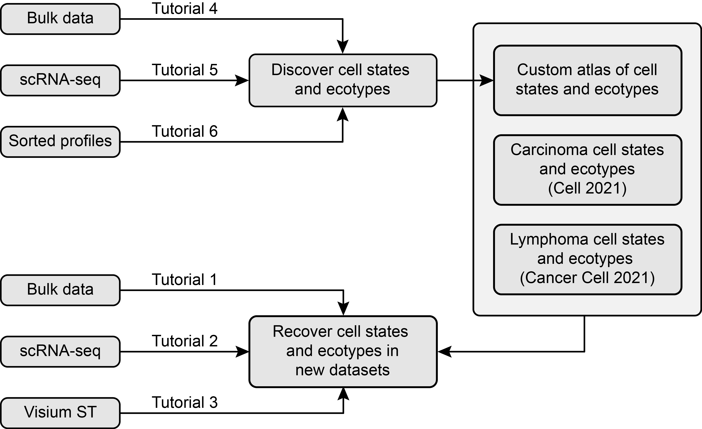

## **Tutorial 1:** Recovery of Cell States and Ecotypes in User-Provided Bulk Data

EcoTyper comes pre-loaded with the resources necessary for the
reference-guided recovery of cell states and ecotypes previously defined
in carcinoma or lymphoma, in user-provided bulk expression data. In the
[carcinoma EcoTyper paper](https://doi.org/10.1016/j.cell.2021.09.014),
we demonstrate that prior deconvolution of bulk data using *CIBERSORTx
HiRes* is not necessary for high-fidelity recovery of cell states in
bulk-tissue expression data. We can proceed to the recovery of states
based on bulk data only.

In this tutorial, we illustrate how EcoTyper can be used to recover the
cell states and ecotypes that we defined across **carcinomas** and in
**diffuse large B cell lymphoma** (DLBCL), in a set of the bulk samples
from lung adenocarcinoma (LUAD) from TCGA and [bulk
samples](https://www.nature.com/articles/s41591-018-0016-8) from diffuse
large-cell lymphoma (DLBCL), respectively. Plese note that the recovery
procedure described in this tutorial can also be applied on user-defined
cell states and ecotypes, derived as described in Tutorials 4-6.

### 1.1. Recovery of **Carcinoma** Cell States and Ecotypes in Bulk Data

For this section, we used a subset of the TCGA bulk samples from lung
adenocarcinoma (LUAD), available in `example_data/bulk_lung_data.txt`,
together with the sample annotation file
`example_data/bulk_lung_annotation.txt`.

The script used to perform recovery in bulk data is called
`EcoTyper_recovery_bulk.R`:

``` bash
Rscript EcoTyper_recovery_bulk.R -h
```

    ## usage: EcoTyper_recovery_bulk.R [-d <character>] [-m <PATH>] [-a <PATH>]
    ##                                 [-c <character>] [-t <integer>] [-o <PATH>]
    ##                                 [-h]
    ## 
    ## Arguments:
    ##   -d <character>, --discovery <character>
    ##                         The name of the discovery dataset used to define cell
    ##                         states and ecotypes. Accepted values: 'Carcinoma' will
    ##                         recover the cell states and ecotypes defined across
    ##                         carcinomas, as described in the EcoTyper carcinoma
    ##                         paper, 'Lymphoma' will recover the cell states and
    ##                         ecotypes defined in diffuse large B cell lymphoma
    ##                         (DLBCL), as described in the EcoTyper lymphoma paper,
    ##                         '<MyDiscovery>' the value used in the field 'Discovery
    ##                         dataset name' of the config file used for running
    ##                         EcoTyper discovery ('EcoTyper_discovery.R') script.
    ##                         [default: 'Carcinoma']
    ##   -m <PATH>, --matrix <PATH>
    ##                         Path to a tab-delimited file containing the input bulk
    ##                         tissue expression matrix, with gene names on the first
    ##                         column and sample ids as column names [required].
    ##   -a <PATH>, --annotation <PATH>
    ##                         Path to a tab-delimited annotation file containing the
    ##                         annotation of samples in the input matrix. This file
    ##                         has to contain in column 'ID' the same ids used as
    ##                         column names in the input matrix, and any number of
    ##                         additional columns. The additional columns can be
    ##                         plotted as color bars in the output heatmaps.
    ##                         [default: 'NULL']
    ##   -c <character>, --columns <character>
    ##                         A comma-spearated list of column names from the
    ##                         annotation file to be plotted as color bar in the
    ##                         output heatmaps. [default: 'NULL']
    ##   -t <integer>, --threads <integer>
    ##                         Number of threads. [default: '10']
    ##   -o <PATH>, --output <PATH>
    ##                         Output directory path. [default: 'RecoveryOutput']
    ##   -h, --help            Print help message.

The script takes the following arguments:

-   *-d*/*–discovery*: The name of the discovery dataset used for
    defining cell states. By default, the only accepted values are
    *Carcinoma* and *Lymphoma* (case sensitive), which will recover the
    cell states that we already defined across carcinomas and in
    lymphoma, respectively. If the user defined cell states in their own
    data (*Tutorials 4-6*), the name of the discovery dataset is the
    value provided in the *Discovery dataset name* field of the
    configuration file used for running cell state discovery. In our
    tutorial, the name of the discovery dataset is *Carcinoma*.

-   *-m*/*–matrix*: Path to the input expression matrix. The expression
    matrix should be in the TPM or FPKM space for bulk RNA-seq and
    **non-logarithmic** (exponential) space for microarrays. It should
    have gene symbols on the first column and gene counts for each
    sample on the next columns. Column (sample) names should be unique.
    Also, we recommend that the column names do not contain special
    characters that are modified by the R function *make.names*, *e.g.*
    having digits at the beginning of the name or containing characters
    such as *space*, *tab* or *-*. The lung cancer scRNA-seq data used
    in this tutorial looks as follows:

``` r
data = read.delim("example_data/bulk_lung_data.txt", nrow = 5)
head(data[,1:5])
```

    ##      Gene TCGA.37.A5EN.01A.21R.A26W.07 TCGA.37.4133.01A.01R.1100.07
    ## 1    A1BG                   18.6400165                 18.196602709
    ## 2    A1CF                    0.0338368                  0.002095014
    ## 3     A2M                   54.1463351                 35.714991125
    ## 4   A2ML1                    4.9953315                  2.383752067
    ## 5 A3GALT2                    0.0438606                  0.000000000
    ##   TCGA.77.7465.01A.11R.2045.07 TCGA.34.5240.01A.01R.1443.07
    ## 1                  24.83635354                 23.579201761
    ## 2                   0.02301987                  0.004186634
    ## 3                  80.63633736                 86.804257397
    ## 4                   4.08688641                  3.015307103
    ## 5                   0.00000000                  0.000000000

-   *-a*/*–annotation*: Path to a tab-delimited annotation file (not
    required). If provided, this file should contain a column called
    *ID* with the same values as the columns of the expression matrix.
    Additionally, this file can contain any number of columns, that can
    be used for plotting as color bars in the output heatmaps (see
    argument *-c*/*–columns*).

``` r
data = read.delim("example_data/bulk_lung_annotation.txt")
head(data)
```

    ##                             ID Tissue Histology                Type OS_Time
    ## 1 TCGA.37.A5EN.01A.21R.A26W.07  Tumor      LUSC Primary Solid Tumor     660
    ## 2 TCGA.37.4133.01A.01R.1100.07  Tumor      LUSC Primary Solid Tumor     238
    ## 3 TCGA.77.7465.01A.11R.2045.07  Tumor      LUSC Primary Solid Tumor     990
    ## 4 TCGA.34.5240.01A.01R.1443.07  Tumor      LUSC Primary Solid Tumor    1541
    ## 5 TCGA.05.4249.01A.01R.1107.07  Tumor      LUAD Primary Solid Tumor    1523
    ## 6 TCGA.62.8398.01A.11R.2326.07  Tumor      LUAD Primary Solid Tumor     444
    ##   OS_Status
    ## 1         0
    ## 2         0
    ## 3         0
    ## 4         0
    ## 5         0
    ## 6         1

-   *-c*/*–columns*: A comma-separated list of column names from the
    annotation file (see argument *-a*/*–annotation*) to be plotted as
    color bars in the output heatmaps. By default, the output heatmaps
    contain as color bar the cell state label each cell is assigned to.
    The column names indicated by this argument will be added to that
    color bar.

-   *-t*/*–threads*: Number of threads. Default: 10.

-   *-o*/*–output*: Output folder. The output folder will be created if
    it does not exist.

The command line for recovering the carcinoma cell states and ecotypes
in the example bulk data is:

``` bash
Rscript EcoTyper_recovery_bulk.R -d Carcinoma -m example_data/bulk_lung_data.txt -a example_data/bulk_lung_annotation.txt -c Tissue -o RecoveryOutput
```

The output of this script for each cell type includes:

-   The abundance (fraction) of each cell state in each sample:

``` r
data = read.delim("RecoveryOutput/bulk_lung_data/Fibroblasts/state_abundances.txt")
head(data[,1:5])
```

    ##     TCGA.37.A5EN.01A.21R.A26W.07 TCGA.37.4133.01A.01R.1100.07
    ## S01                 2.083264e-15                  0.018526046
    ## S02                 1.379863e-01                  0.012301783
    ## S03                 1.296628e-01                  0.003181937
    ## S04                 7.119142e-03                  0.003346075
    ##     TCGA.77.7465.01A.11R.2045.07 TCGA.34.5240.01A.01R.1443.07
    ## S01                   0.05884281                   0.01150542
    ## S02                   0.18379510                   0.05917894
    ## S03                   0.07466737                   0.06311084
    ## S04                   0.05295505                   0.03820861
    ##     TCGA.05.4249.01A.01R.1107.07
    ## S01                   0.35434105
    ## S02                   0.28080083
    ## S03                   0.11240927
    ## S04                   0.04851547

-   The assignment of samples to the state with highest abundance. If
    the cell state with the highest abundance is one of the cell states
    filtered by the automatic QC filters of EcoTyper, the sample is
    considered unassigned and filtered out from this table. For more
    information about the sample filtering procedure please see the
    *Cell state quality control* section of the [EcoTyper
    paper](https://doi.org/10.1016/j.cell.2021.09.014) methods:

``` r
data = read.delim("RecoveryOutput/bulk_lung_data/Fibroblasts/state_assignment.txt")
head(data[,c("ID", "State")])
```

    ##                             ID State
    ## 1 TCGA.05.4249.01A.01R.1107.07   S01
    ## 2 TCGA.50.6590.01A.12R.1858.07   S01
    ## 3 TCGA.55.6983.11A.01R.1949.07   S01
    ## 4 TCGA.69.7761.01A.11R.2170.07   S01
    ## 5 TCGA.93.7347.01A.11R.2187.07   S01
    ## 6 TCGA.73.4662.01A.01R.1206.07   S01

-   Two heatmaps: the heatmap representing the expression of “marker”
    genes for each state (See Tutorial 4 for more details) in the
    discovery dataset and in the user-provided bulk dataset:

``` r
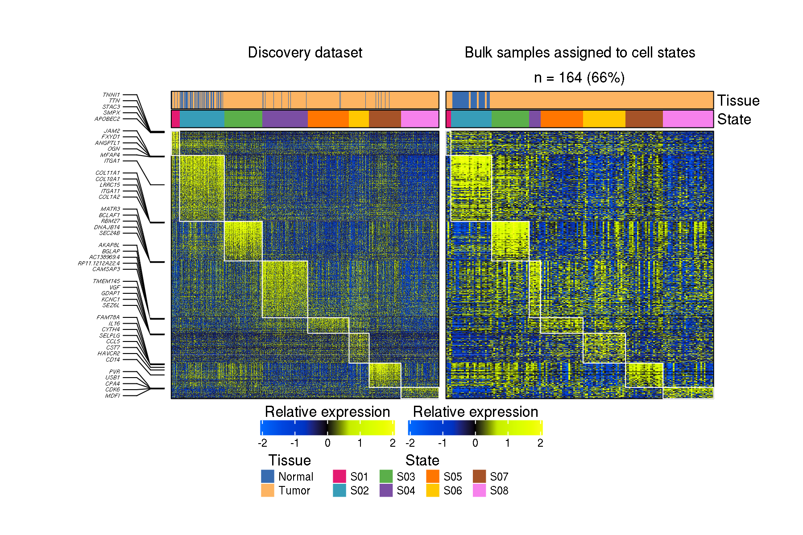
```


The output for ecotypes includes:

-   The abundance (fraction) of each ecotype in each sample:

``` r
assign = read.delim("RecoveryOutput/bulk_lung_data/Ecotypes/ecotype_abundance.txt")
dim(assign)
```

    ## [1]   9 250

``` r
head(assign[,1:5])
```

    ##     TCGA.37.A5EN.01A.21R.A26W.07 TCGA.37.4133.01A.01R.1100.07
    ## LE1                   0.16417228                   0.02365489
    ## LE2                   0.08192505                   0.05046453
    ## LE3                   0.12463032                   0.61936802
    ## LE4                   0.01515642                   0.04878655
    ## LE5                   0.16935221                   0.04596270
    ## LE6                   0.18055183                   0.04292269
    ##     TCGA.77.7465.01A.11R.2045.07 TCGA.34.5240.01A.01R.1443.07
    ## LE1                   0.13700230                   0.05801216
    ## LE2                   0.03932840                   0.04340269
    ## LE3                   0.25247584                   0.49820232
    ## LE4                   0.10528174                   0.02365418
    ## LE5                   0.06864643                   0.03466751
    ## LE6                   0.09809911                   0.05476600
    ##     TCGA.05.4249.01A.01R.1107.07
    ## LE1                   0.10219731
    ## LE2                   0.05493172
    ## LE3                   0.10202715
    ## LE4                   0.12493246
    ## LE5                   0.09788877
    ## LE6                   0.10122469

-   The assignment of samples to the carcinoma ecotype with the highest
    abundance. If the cell state fractions from the dominant ecotype are
    not significantly higher than the other cell state fractions in a
    given sample, the sample is considered unassigned and filtered out
    from this table. For more information about the sample filtering
    procedure please see the *Ecotype discovery* section of the
    [EcoTyper paper](https://doi.org/10.1016/j.cell.2021.09.014)
    methods:

``` r
discrete_assignments = read.delim("RecoveryOutput/bulk_lung_data/Ecotypes/ecotype_abundance.txt")
dim(discrete_assignments)
```

    ## [1]   9 250

``` r
head(discrete_assignments[,1:5])
```

    ##     TCGA.37.A5EN.01A.21R.A26W.07 TCGA.37.4133.01A.01R.1100.07
    ## LE1                   0.16417228                   0.02365489
    ## LE2                   0.08192505                   0.05046453
    ## LE3                   0.12463032                   0.61936802
    ## LE4                   0.01515642                   0.04878655
    ## LE5                   0.16935221                   0.04596270
    ## LE6                   0.18055183                   0.04292269
    ##     TCGA.77.7465.01A.11R.2045.07 TCGA.34.5240.01A.01R.1443.07
    ## LE1                   0.13700230                   0.05801216
    ## LE2                   0.03932840                   0.04340269
    ## LE3                   0.25247584                   0.49820232
    ## LE4                   0.10528174                   0.02365418
    ## LE5                   0.06864643                   0.03466751
    ## LE6                   0.09809911                   0.05476600
    ##     TCGA.05.4249.01A.01R.1107.07
    ## LE1                   0.10219731
    ## LE2                   0.05493172
    ## LE3                   0.10202715
    ## LE4                   0.12493246
    ## LE5                   0.09788877
    ## LE6                   0.10122469

-   A heatmap of cell state abundances across the samples assigned to
    ecotypes. Rows correspond to the cell states forming ecotypes, while
    columns correspond to the samples assigned to ecotypes:

``` r
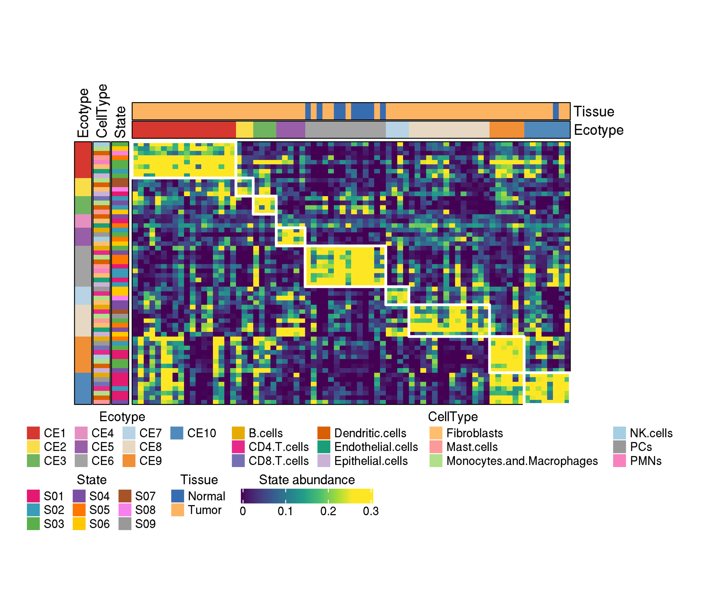
```


### 1.2. Recovery of **Lymphoma** Cell States and Ecotypes in Bulk Data

For this section, we used a subset of the [bulk
samples](https://www.nature.com/articles/s41591-018-0016-8) from diffuse
large-cell lymphoma (DLBCL), available in
`example_data/bulk_lymphoma_data.txt`, together with the sample
annotation file `example_data/bulk_lymphoma_annotation.txt`.

The script used to perform recovery in bulk data is called
`EcoTyper_recovery_bulk.R`:

``` bash
Rscript EcoTyper_recovery_bulk.R -h
```

    ## usage: EcoTyper_recovery_bulk.R [-d <character>] [-m <PATH>] [-a <PATH>]
    ##                                 [-c <character>] [-t <integer>] [-o <PATH>]
    ##                                 [-h]
    ## 
    ## Arguments:
    ##   -d <character>, --discovery <character>
    ##                         The name of the discovery dataset used to define cell
    ##                         states and ecotypes. Accepted values: 'Carcinoma' will
    ##                         recover the cell states and ecotypes defined across
    ##                         carcinomas, as described in the EcoTyper carcinoma
    ##                         paper, 'Lymphoma' will recover the cell states and
    ##                         ecotypes defined in diffuse large B cell lymphoma
    ##                         (DLBCL), as described in the EcoTyper lymphoma paper,
    ##                         '<MyDiscovery>' the value used in the field 'Discovery
    ##                         dataset name' of the config file used for running
    ##                         EcoTyper discovery ('EcoTyper_discovery.R') script.
    ##                         [default: 'Carcinoma']
    ##   -m <PATH>, --matrix <PATH>
    ##                         Path to a tab-delimited file containing the input bulk
    ##                         tissue expression matrix, with gene names on the first
    ##                         column and sample ids as column names [required].
    ##   -a <PATH>, --annotation <PATH>
    ##                         Path to a tab-delimited annotation file containing the
    ##                         annotation of samples in the input matrix. This file
    ##                         has to contain in column 'ID' the same ids used as
    ##                         column names in the input matrix, and any number of
    ##                         additional columns. The additional columns can be
    ##                         plotted as color bars in the output heatmaps.
    ##                         [default: 'NULL']
    ##   -c <character>, --columns <character>
    ##                         A comma-spearated list of column names from the
    ##                         annotation file to be plotted as color bar in the
    ##                         output heatmaps. [default: 'NULL']
    ##   -t <integer>, --threads <integer>
    ##                         Number of threads. [default: '10']
    ##   -o <PATH>, --output <PATH>
    ##                         Output directory path. [default: 'RecoveryOutput']
    ##   -h, --help            Print help message.

The script takes the following arguments:

-   *-d*/*–discovery*: The name of the discovery dataset used for
    defining cell states. By default, the only accepted values are
    *Carcinoma* and *Lymphoma* (case sensitive), which will recover the
    cell states that we already defined across carcinomas and in
    lymphoma, respectively. If the user defined cell states in their own
    data (*Tutorials 4-6*), the name of the discovery dataset is the
    value provided in the *Discovery dataset name* field of the
    configuration file used for running cell state discovery.

-   *-m*/*–matrix*: Path to the input expression matrix. The expression
    matrix should be in the TPM or FPKM space for bulk RNA-seq and
    **non-logarithmic** (exponential) space for microarrays. It should
    have gene symbols on the first column and gene counts for each
    sample on the next columns. Column (sample) names should be unique.
    Also, we recommend that the column names do not contain special
    characters that are modified by the R function *make.names*, *e.g.*
    having digits at the beginning of the name or containing characters
    such as *space*, *tab* or *-*. The bulk data used in this tutorial
    looks as follows:

``` r
data = read.delim("example_data/bulk_lymphoma_data.txt", nrow = 5)
head(data[,1:5])
```

    ##      GENES MS2010072001 MS2010072003 MS2010072004 MS2010072017
    ## 1     A1BG    319.59498   273.512399    263.81912    432.18048
    ## 2 A1BG_AS1     19.68925   100.372538     90.50134     19.58759
    ## 3     A1CF     49.99656     6.447184     51.09232     36.02929
    ## 4      A2M   3578.38986  3463.803236   2754.17141   1080.29716
    ## 5  A2M_AS1   2976.90082   102.167762   1044.81788     38.24889

-   *-a*/*–annotation*: Path to a tab-delimited annotation file (not
    required). If provided, this file should contain a column called
    **ID** with the same values as the columns of the expression matrix.
    Additionally, this file can contain any number of columns, that can
    be used for plotting as color bars in the output heatmaps (see
    argument *-c*/*–columns*).

``` r
data = read.delim("example_data/bulk_lymphoma_annotation.txt")
head(data)
```

    ##                                                    ID          COO
    ## 1                                        MS2010072838 Unclassified
    ## 2 LONGS_p_DLBCL_AffyExpr_01_HG_U133_Plus_2_B03_830732          GCB
    ## 3 LONGS_p_DLBCL_AffyExpr_01_HG_U133_Plus_2_C11_830764          ABC
    ## 4                                        MS2010072042          ABC
    ## 5                                        MS2010072816          ABC
    ## 6                                        MS2010072921          ABC
    ##   schmitz_labels
    ## 1             N1
    ## 2            EZB
    ## 3          Other
    ## 4            BN2
    ## 5            BN2
    ## 6          Other

-   *-c*/*–columns*: A comma-separated list of column names from the
    annotation file (see argument *-a*/*–annotation*) to be plotted as
    color bars in the output heatmaps. By default, the output heatmaps
    contain as color bar the cell state label each cell is assigned to.
    The column names indicated by this argument will be added to that
    color bar.

-   *-t*/*–threads*: Number of threads. Default: 10.

-   *-o*/*–output*: Output folder. The output folder will be created if
    doesn’t exist.

The command line for recovering the lymphoma cell states and ecotypes in
the example bulk data is:

``` bash
Rscript EcoTyper_recovery_bulk.R -d Lymphoma -m example_data/bulk_lymphoma_data.txt -a example_data/bulk_lymphoma_annotation.txt -c schmitz_labels,COO -o RecoveryOutput
```

The output of this script for each cell type includes:

-   The abundance (fraction) of each cell state in each sample:

``` r
data = read.delim("RecoveryOutput/bulk_lymphoma_data/B.cells/state_abundances.txt")
head(data[,1:5])
```

    ##     MS2010072001 MS2010072003 MS2010072004 MS2010072017 MS2010072019
    ## S01 2.373248e-03 3.595618e-01 3.806641e-05 3.697861e-01 5.385940e-01
    ## S02 4.782425e-01 5.127354e-02 4.068437e-01 8.661441e-16 1.260096e-15
    ## S03 5.000272e-01 2.657648e-01 3.208192e-01 3.871464e-02 1.262404e-01
    ## S04 1.409287e-15 2.861731e-01 1.020793e-01 2.570570e-07 6.271926e-03
    ## S05 1.935706e-02 7.028482e-05 1.046191e-01 8.195354e-02 1.693508e-05

-   The assignment of samples to the state with highest abundance. If
    the cell state with the highest abundance is one of the cell states
    filtered by the automatic QC filters of EcoTyper, the sample is
    considered unassigned and filtered out from this table. For more
    information about the sample filtering procedure please see the
    *Cell state quality control* section of the \[EcoTyper paper\]
    (<https://doi.org/10.1016/j.cell.2021.09.014>) methods:

``` r
data = read.delim("RecoveryOutput/bulk_lymphoma_data/B.cells/state_assignment.txt")
head(data[,c("ID", "State")])
```

    ##             ID State
    ## 1 MS2010072003   S01
    ## 2 MS2010072019   S01
    ## 3 MS2010072024   S01
    ## 4 MS2010072030   S01
    ## 5 MS2010072037   S01
    ## 6 MS2010072040   S01

-   Two heatmaps: the heatmap representing the expression of “marker”
    genes for each state (See [Tutorial
    3](#tutorial-3-recovery-of-cell-states-and-ecotypes-in-spatial-transcriptomics-data)
    for more details) in the discovery dataset and in the user-provided
    bulk dataset:

``` r
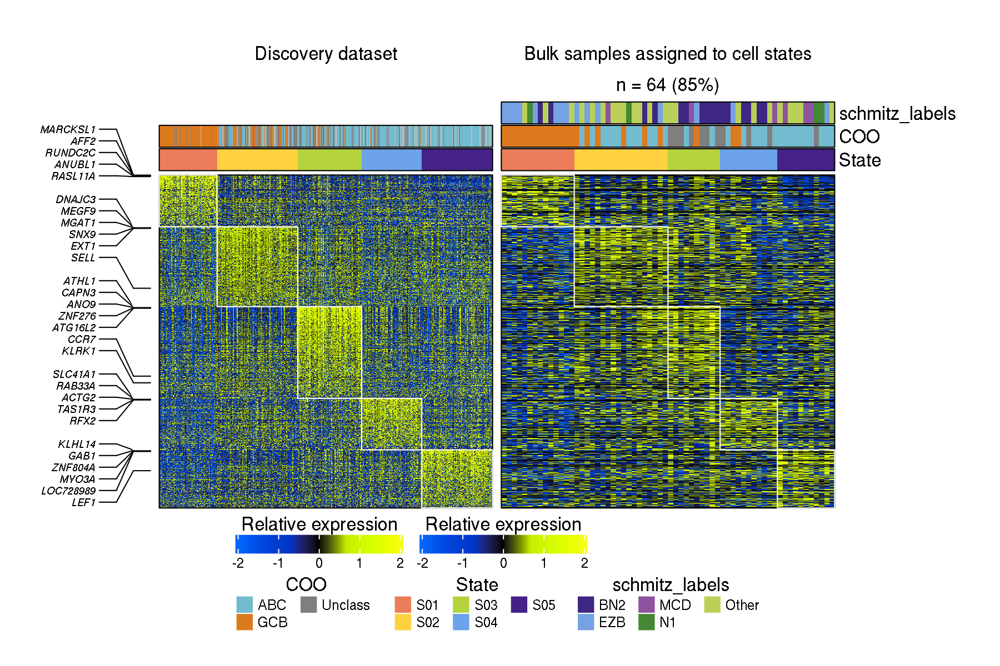
```


The output for ecotypes includes:

-   The abundance (fraction) of each ecotype in each sample:

``` r
assign = read.delim("RecoveryOutput/bulk_lymphoma_data/Ecotypes/ecotype_abundance.txt")
dim(assign)
```

    ## [1]  9 75

``` r
head(assign[,1:5])
```

    ##     MS2010072001 MS2010072003 MS2010072004 MS2010072017 MS2010072019
    ## LE1   0.04957052   0.08169883   0.08724611 7.549536e-02  0.039440174
    ## LE2   0.01006307   0.12841183   0.09457992 2.747772e-02  0.002943328
    ## LE3   0.05278894   0.03158038   0.07019048 2.622030e-01  0.246744970
    ## LE4   0.30161978   0.03494590   0.08382893 4.458162e-15  0.009809012
    ## LE5   0.17506202   0.19692135   0.14271831 1.226647e-01  0.137689497
    ## LE6   0.09394966   0.09523241   0.13293934 2.158494e-01  0.155547222

-   The assignment of samples to the lymphoma ecotype with the highest
    abundance. If the cell state fractions from the dominant ecotype are
    not significantly higher than the other cell state fractions in a
    given sample, the sample is considered unassigned and filtered out
    from this table. For more information about the sample filtering
    procedure please see the *Ecotype discovery* section of the
    [EcoTyper paper](https://doi.org/10.1016/j.cell.2021.09.014)
    methods:

``` r
discrete_assignments = read.delim("RecoveryOutput/bulk_lymphoma_data/Ecotypes/ecotype_abundance.txt")
dim(discrete_assignments)
```

    ## [1]  9 75

``` r
head(discrete_assignments[,1:5])
```

    ##     MS2010072001 MS2010072003 MS2010072004 MS2010072017 MS2010072019
    ## LE1   0.04957052   0.08169883   0.08724611 7.549536e-02  0.039440174
    ## LE2   0.01006307   0.12841183   0.09457992 2.747772e-02  0.002943328
    ## LE3   0.05278894   0.03158038   0.07019048 2.622030e-01  0.246744970
    ## LE4   0.30161978   0.03494590   0.08382893 4.458162e-15  0.009809012
    ## LE5   0.17506202   0.19692135   0.14271831 1.226647e-01  0.137689497
    ## LE6   0.09394966   0.09523241   0.13293934 2.158494e-01  0.155547222

-   A heatmap of cell state abundances across the samples assigned to
    ecotypes. Rows correspond to the cell states forming ecotypes, while
    columns correspond to the samples assigned to ecotypes:

``` r
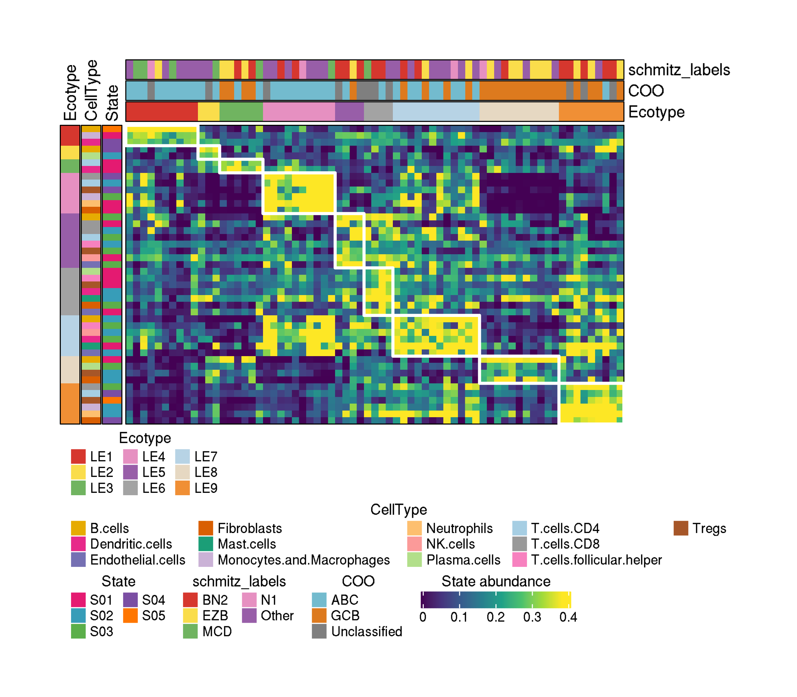
```


## **Tutorial 2:** Recovery of Cell States and Ecotypes in User-Provided scRNA-seq Data

EcoTyper comes pre-loaded with the resources necessary for the
reference-guided recovery of cell states and ecotypes previously defined
in carcinoma and lymphoma, in user-provided scRNA-seq data.

In this tutorial, we illustrate how EcoTyper can be used to recover the
cell states and ecotypes, that we defined across **carcinomas** and in
**diffuse large B cell lymphoma** (DLBCL), in a downsampled version of a
[scRNA-seq dataset](https://www.nature.com/articles/s41588-020-0636-z)
from colorectal cancer specimens, and a downsampled version of a
scRNA-seq dataset from lymphoma specimens, respectively. Plese note that
the recovery procedure described in this tutorial can also be applied on
user-defined cell states and ecotypes, derived as described in Tutorials
4-6.

### 2.1. Recovery of **Carcinoma** Cell States and Ecotypes in scRNA-seq Data

In this section we illustrate how carcinoma cell states can be recovered
in a scRNA-seq dataset from colorectal cancer specimens. The expression
data used in this tutorial can be found in
`example_data/scRNA_CRC_data.txt`, and its corresponding sample
annotation in `example_data/scRNA_CRC_annotation.txt`.

The script used to perform recovery in scRNA-seq data is
`EcoTyper_recovery_scRNA.R`:

``` bash
Rscript EcoTyper_recovery_scRNA.R -h
```

    ## usage: EcoTyper_recovery_scRNA.R [-d <character>] [-m <PATH>] [-a <PATH>]
    ##                                  [-c <character>] [-z <bool>] [-s <integer>]
    ##                                  [-t <integer>] [-o <PATH>] [-h]
    ## 
    ## Arguments:
    ##   -d <character>, --discovery <character>
    ##                         The name of the discovery dataset used to define cell
    ##                         states and ecotypes. Accepted values: 'Carcinoma' will
    ##                         recover the cell states and ecotypes defined across
    ##                         carcinomas, as described in the EcoTyper carcinoma
    ##                         paper, 'Lymphoma' will recover the cell states and
    ##                         ecotypes defined in diffuse large B cell lymphoma
    ##                         (DLBCL), as described in the EcoTyper lymphoma paper,
    ##                         '<MyDiscovery>' the value used in the field 'Discovery
    ##                         dataset name' of the config file used for running
    ##                         EcoTyper discovery ('EcoTyper_discovery.R') script.
    ##                         [default: 'Carcinoma']
    ##   -m <PATH>, --matrix <PATH>
    ##                         Path to a tab-delimited file containing the input
    ##                         scRNA-seq expression matrix, with gene names on the
    ##                         first column and cell ids as column names [required].
    ##   -a <PATH>, --annotation <PATH>
    ##                         Path to a tab-delimited annotation file containing the
    ##                         annotation of cells in the input matrix. This file
    ##                         should contain at least two columns, 'ID' with the
    ##                         same values as the columns of the expression matrix,
    ##                         and 'CellType' (case sensitive) which contains the
    ##                         cell type for each cell. These values are limited to
    ##                         the set of cell types analyzed in the discovery
    ##                         dataset. If the argument '-d' is set to 'Carcinoma',
    ##                         then the accepted values for column 'CellType' are:
    ##                         'B.cells', 'CD4.T.cells', 'CD8.T.cells',
    ##                         'Dendritic.cells', 'Endothelial.cells',
    ##                         'Epithelial.cells', 'Fibroblasts', 'Mast.cells',
    ##                         'Monocytes.and.Macrophages', 'NK.cells', 'PCs' and
    ##                         'PMNs'. If the argument '-d' is set to 'Lymphoma',
    ##                         then the accepted values for column 'CellType' are:
    ##                         'B.cells', 'Plasma.cells', 'T.cells.CD8',
    ##                         'T.cells.CD4', 'T.cells.follicular.helper', 'Tregs',
    ##                         'NK.cells', 'Monocytes.and.Macrophages',
    ##                         'Dendritic.cells', 'Mast.cells', 'Neutrophils',
    ##                         'Fibroblasts', 'Endothelial.cells'. All other values
    ##                         will be ignored for these two cases. Additionally,
    ##                         this file can contain any number of columns, that can
    ##                         be used for plotting color bars in the output heatmaps
    ##                         (see argument '-c'). [required]
    ##   -c <character>, --columns <character>
    ##                         A comma-spearated list of column names from the
    ##                         annotation file to be plotted as color bar in the
    ##                         output heatmaps. [default: 'NULL']
    ##   -z <bool>, --z-score <bool>
    ##                         A flag indicating whether the significance
    ##                         quantification procedure should be run. Note that this
    ##                         procedure might be slow, as the NMF model is applied
    ##                         30 times on the same dataset. [default: 'FALSE']
    ##   -s <integer>, --subsample <integer>
    ##                         An integer specifying the number of cells each cell
    ##                         type will be downsampled to. For values <50, no
    ##                         downsampling will be performed. [default: '-1' (no
    ##                         downsampling)]
    ##   -t <integer>, --threads <integer>
    ##                         Number of threads. [default: '10']
    ##   -o <PATH>, --output <PATH>
    ##                         Output directory path. [default: 'RecoveryOutput']
    ##   -h, --help            Print help message.

The script takes the following arguments:

-   *-d*/*–discovery*: The name of the discovery dataset used for
    defining cell states. By default, the only accepted values are
    *Carcinoma* and *Lymphoma* (case sensitive), which will recover the
    cell states that we already defined across carcinomas and in
    lymphoma, respectively. If the user defined cell states in their own
    data (*Tutorial 4-6*), the name of the discovery dataset is the
    value provided in the *Discovery dataset name* field of the
    configuration file used for running cell state discovery. For this
    tutorial, we set the name of the discovery dataset to *Carcinoma*.

-   *-m*/*–matrix*: Path to the input scRNA-seq matrix. The scRNA-seq
    expression matrix should be a tab-delimited file, with gene symbols
    on the first column and cells on the next columns. It should have
    cell identifiers (e.g. barcodes) as column names, and should be in
    TPM, CPM, FPKM or any other suitable count format. Gene symbols and
    cell identifiers should be unique. Moreover, we recommend that the
    column names do not contain special characters that are modified by
    the R function *make.names*, *e.g.* having digits at the beginning
    of the name or containing characters such as *space*, *tab* or *-*.
    The CRC cancer scRNA-seq data used in this tutorial looks as
    follows:

``` r
data = read.delim("example_data/scRNA_CRC_data.txt", nrow = 5)
head(data[,1:5])
```

    ##      Gene SMC01.T_AAAGATGCATGGATGG SMC01.T_AAAGTAGCAAGGACAC
    ## 1    A1BG                        0                        0
    ## 2    A1CF                        0                        0
    ## 3     A2M                        0                        0
    ## 4   A2ML1                        0                        0
    ## 5 A3GALT2                        0                        0
    ##   SMC01.T_AAATGCCAGGATCGCA SMC01.T_AACTCTTCACAACGCC
    ## 1                        0                        0
    ## 2                        0                        0
    ## 3                        0                        0
    ## 4                        0                        0
    ## 5                        0                        0

-   *-a*/*–annotation*: Path to a tab-delimited annotation file. This
    file should contain at least two columns: *ID* with the same values
    as the columns of the expression matrix, and *CellType* (case
    sensitive) which contains the cell type for each cell. The values in
    column *CellType* should indicate for each cell its cell type. These
    values are limited to the set of cell types analyzed in the
    discovery dataset. If the argument *-d*/*–discovery* is set to
    *Carcinoma* (as is the case for this tutorial), then the accepted
    values for column *CellType* are: ‘B.cells’, ‘CD4.T.cells’,
    ‘CD8.T.cells’, ‘Dendritic.cells’, ‘Endothelial.cells’,
    ‘Epithelial.cells’, ‘Fibroblasts’, ‘Mast.cells’,
    ‘Monocytes.and.Macrophages’, ‘NK.cells’, ‘PCs’ and ‘PMNs’. If the
    argument *-d*/*–discovery* is set to *Lymphoma*, then the accepted
    values for column *CellType* are: ‘B.cells’, ‘Plasma.cells’,
    ‘T.cells.CD8’, ‘T.cells.CD4’, ‘T.cells.follicular.helper’, ‘Tregs’,
    ‘NK.cells’, ‘Monocytes.and.Macrophages’, ‘Dendritic.cells’,
    ‘Mast.cells’, ‘Neutrophils’, ‘Fibroblasts’, ‘Endothelial.cells’. All
    other values will be ignored for these two cases. The annotation
    file can contain a column called *Sample*. If this column is
    present, the ecotype recovery will be performed, in addition to cell
    state recovery. Moreover, this file can contain any number of
    columns, that can be used for plotting color bars in the output
    heatmaps (see argument *-c*/*–columns*).

``` r
data = read.delim("example_data/scRNA_CRC_annotation.txt")
head(data)
```

    ##                      Index Patient Class  Sample        Cell_type Cell_subtype
    ## 1 SMC01-T_AAAGATGCATGGATGG   SMC01 Tumor SMC01-T Epithelial cells         CMS2
    ## 2 SMC01-T_AAAGTAGCAAGGACAC   SMC01 Tumor SMC01-T Epithelial cells         CMS2
    ## 3 SMC01-T_AAATGCCAGGATCGCA   SMC01 Tumor SMC01-T Epithelial cells         CMS2
    ## 4 SMC01-T_AACTCTTCACAACGCC   SMC01 Tumor SMC01-T Epithelial cells         CMS2
    ## 5 SMC01-T_AACTTTCGTTCGGGCT   SMC01 Tumor SMC01-T Epithelial cells         CMS2
    ## 6 SMC01-T_AAGGTTCTCCAATGGT   SMC01 Tumor SMC01-T Epithelial cells         CMS2
    ##           CellType                       ID Tissue
    ## 1 Epithelial.cells SMC01.T_AAAGATGCATGGATGG  Tumor
    ## 2 Epithelial.cells SMC01.T_AAAGTAGCAAGGACAC  Tumor
    ## 3 Epithelial.cells SMC01.T_AAATGCCAGGATCGCA  Tumor
    ## 4 Epithelial.cells SMC01.T_AACTCTTCACAACGCC  Tumor
    ## 5 Epithelial.cells SMC01.T_AACTTTCGTTCGGGCT  Tumor
    ## 6 Epithelial.cells SMC01.T_AAGGTTCTCCAATGGT  Tumor

-   *-c*/*–columns*: A comma-separated list of column names from the
    annotation file (see argument *-a*/*–annotation*) to be plotted as
    color bars in the output heatmaps. By default, the output heatmaps
    contain as color bar the cell state label each cell is assigned to.
    The column names indicated by this argument will be added to that
    color bar.

-   *-z*/*–z-score*: Flag indicating whether the significance
    quantification procedure should be run (default is *FALSE*). This
    procedure allows users to determine whether cell states are
    significantly recovered in a given dataset. Please note that this
    procedure can be very slow, as the NMF model is applied 30 times on
    the same dataset.

-   *-s*/*–subsample*: An integer specifying the number of cells each
    cell type will be downsampled to. For values \<50, no downsampling
    will be performed. Default: -1 (no downsampling).

-   *-t*/*–threads*: Number of threads. Default: 10.

-   *-o*/*–output*: Output folder. The output folder will be created if
    it does not exist.

The command line for recovering the carcinoma cell states in the example
scRNA-seq data is:

``` bash
Rscript EcoTyper_recovery_scRNA.R -d Carcinoma -m example_data/scRNA_CRC_data.txt -a example_data/scRNA_CRC_annotation.txt -o RecoveryOutput
```

The outputs of this script include the following files, for each cell
type provided:

-   The assignment of single cells to states:

``` r
data = read.delim("RecoveryOutput/scRNA_CRC_data/Fibroblasts/state_assignment.txt")
head(data[,c("ID", "State")])
```

    ##                         ID State
    ## 1 SMC01.T_TGCGCAGTCGGATGGA   S01
    ## 2 SMC04.T_CACAAACTCTACTATC   S01
    ## 3 SMC15.T_GCGCGATTCATAAAGG   S01
    ## 4 SMC17.T_GTACGTAGTGACTACT   S01
    ## 5 SMC20.T_CTAAGACCACTGTCGG   S01
    ## 6 SMC20.T_GTTACAGTCGCGTTTC   S01

-   Two heatmaps: a heatmap representing the expression of cell state
    marker genes (see [Tutorial
    4](#tutorial-4-de-novo-discovery-of-cell-states-and-ecotypes-in-bulk-data)
    for more details) in the discovery dataset, and a heatmap with the
    expression of the same marker genes in the scRNA-seq dataset,
    smoothed to mitigate the impact of scRNA-seq dropout:

``` r
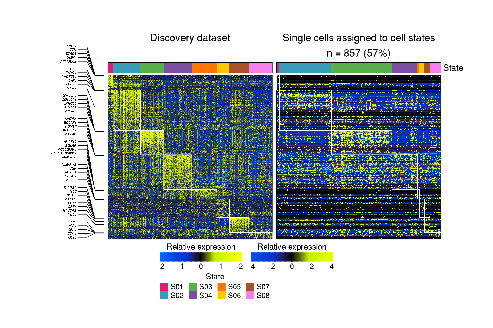
```


-   If the statistical significance quantification method is applied,
    the resulting z-scores for each cell state are output in the same
    directory:

``` r
#data = read.delim("RecoveryOutput/scRNA_CRC_data/Epithelial.cells/recovery_z_scores.txt")
#head(data[,c("State", "Z")])
```

The output for ecotypes includes:

-   The abundance (fraction) of each ecotype in each sample:

``` r
assign = read.delim("RecoveryOutput/scRNA_CRC_data/Ecotypes/ecotype_abundance.txt")
dim(assign)
```

    ## [1] 10 33

``` r
head(assign[,1:5])
```

    ##        SMC01.N     SMC01.T    SMC02.N    SMC02.T    SMC03.N
    ## CE1 0.03013608 0.151493627 0.10825504 0.21601181 0.02930968
    ## CE2 0.00000000 0.009612861 0.00000000 0.02671883 0.00000000
    ## CE3 0.05199290 0.077968658 0.21188075 0.07300246 0.00000000
    ## CE4 0.01693878 0.043794663 0.03124202 0.00000000 0.00000000
    ## CE5 0.06285928 0.022531963 0.01115162 0.06406829 0.03197420
    ## CE6 0.16508230 0.059542004 0.24436913 0.01855854 0.43445664

-   The assignment of samples to the carcinoma ecotype with the highest
    abundance. If the cell state fractions from the dominant ecotype are
    not significantly higher than the other cell state fractions in a
    given sample, the sample is considered unassigned and filtered out
    from this table. For more information about the sample filtering
    procedure please see the *Ecotype discovery* section of the
    [EcoTyper paper](https://doi.org/10.1016/j.cell.2021.09.014)
    methods:

``` r
discrete_assignments = read.delim("RecoveryOutput/scRNA_CRC_data/Ecotypes/ecotype_abundance.txt")
dim(discrete_assignments)
```

    ## [1] 10 33

``` r
head(discrete_assignments[,1:5])
```

    ##        SMC01.N     SMC01.T    SMC02.N    SMC02.T    SMC03.N
    ## CE1 0.03013608 0.151493627 0.10825504 0.21601181 0.02930968
    ## CE2 0.00000000 0.009612861 0.00000000 0.02671883 0.00000000
    ## CE3 0.05199290 0.077968658 0.21188075 0.07300246 0.00000000
    ## CE4 0.01693878 0.043794663 0.03124202 0.00000000 0.00000000
    ## CE5 0.06285928 0.022531963 0.01115162 0.06406829 0.03197420
    ## CE6 0.16508230 0.059542004 0.24436913 0.01855854 0.43445664

-   A heatmap of cell state abundances across the samples assigned to
    ecotypes. Rows correspond to the cell states forming ecotypes, while
    columns correspond to the samples assigned to ecotypes:

``` r
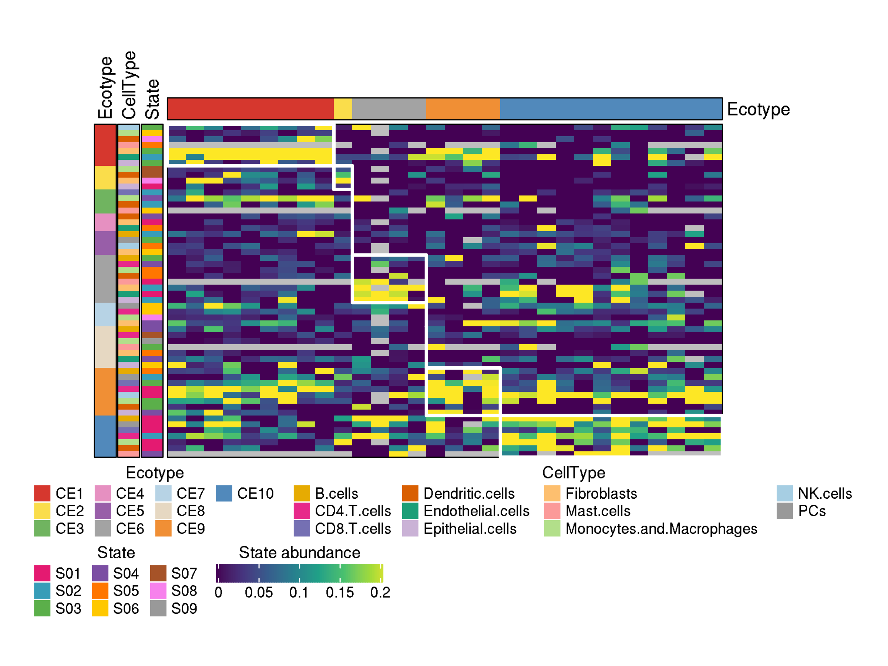
```


### 2.2. Recovery of **Lymphoma** Cell States and Ecotypes in scRNA-seq Data

In this section we illustrate how lymphoma cell states can be recovered
in the scRNA-seq dataset from lymphoma specimens. The expression data
used in this tutorial can be found in
`example_data/scRNA_lymphoma_data.txt`, and sample annotation in
`example_data/scRNA_lymphoma_annotation.txt`.

The script used to perform recovery in scRNA-seq data is called
`EcoTyper_recovery_scRNA.R`:

``` bash
Rscript EcoTyper_recovery_scRNA.R -h
```

    ## usage: EcoTyper_recovery_scRNA.R [-d <character>] [-m <PATH>] [-a <PATH>]
    ##                                  [-c <character>] [-z <bool>] [-s <integer>]
    ##                                  [-t <integer>] [-o <PATH>] [-h]
    ## 
    ## Arguments:
    ##   -d <character>, --discovery <character>
    ##                         The name of the discovery dataset used to define cell
    ##                         states and ecotypes. Accepted values: 'Carcinoma' will
    ##                         recover the cell states and ecotypes defined across
    ##                         carcinomas, as described in the EcoTyper carcinoma
    ##                         paper, 'Lymphoma' will recover the cell states and
    ##                         ecotypes defined in diffuse large B cell lymphoma
    ##                         (DLBCL), as described in the EcoTyper lymphoma paper,
    ##                         '<MyDiscovery>' the value used in the field 'Discovery
    ##                         dataset name' of the config file used for running
    ##                         EcoTyper discovery ('EcoTyper_discovery.R') script.
    ##                         [default: 'Carcinoma']
    ##   -m <PATH>, --matrix <PATH>
    ##                         Path to a tab-delimited file containing the input
    ##                         scRNA-seq expression matrix, with gene names on the
    ##                         first column and cell ids as column names [required].
    ##   -a <PATH>, --annotation <PATH>
    ##                         Path to a tab-delimited annotation file containing the
    ##                         annotation of cells in the input matrix. This file
    ##                         should contain at least two columns, 'ID' with the
    ##                         same values as the columns of the expression matrix,
    ##                         and 'CellType' (case sensitive) which contains the
    ##                         cell type for each cell. These values are limited to
    ##                         the set of cell types analyzed in the discovery
    ##                         dataset. If the argument '-d' is set to 'Carcinoma',
    ##                         then the accepted values for column 'CellType' are:
    ##                         'B.cells', 'CD4.T.cells', 'CD8.T.cells',
    ##                         'Dendritic.cells', 'Endothelial.cells',
    ##                         'Epithelial.cells', 'Fibroblasts', 'Mast.cells',
    ##                         'Monocytes.and.Macrophages', 'NK.cells', 'PCs' and
    ##                         'PMNs'. If the argument '-d' is set to 'Lymphoma',
    ##                         then the accepted values for column 'CellType' are:
    ##                         'B.cells', 'Plasma.cells', 'T.cells.CD8',
    ##                         'T.cells.CD4', 'T.cells.follicular.helper', 'Tregs',
    ##                         'NK.cells', 'Monocytes.and.Macrophages',
    ##                         'Dendritic.cells', 'Mast.cells', 'Neutrophils',
    ##                         'Fibroblasts', 'Endothelial.cells'. All other values
    ##                         will be ignored for these two cases. Additionally,
    ##                         this file can contain any number of columns, that can
    ##                         be used for plotting color bars in the output heatmaps
    ##                         (see argument '-c'). [required]
    ##   -c <character>, --columns <character>
    ##                         A comma-spearated list of column names from the
    ##                         annotation file to be plotted as color bar in the
    ##                         output heatmaps. [default: 'NULL']
    ##   -z <bool>, --z-score <bool>
    ##                         A flag indicating whether the significance
    ##                         quantification procedure should be run. Note that this
    ##                         procedure might be slow, as the NMF model is applied
    ##                         30 times on the same dataset. [default: 'FALSE']
    ##   -s <integer>, --subsample <integer>
    ##                         An integer specifying the number of cells each cell
    ##                         type will be downsampled to. For values <50, no
    ##                         downsampling will be performed. [default: '-1' (no
    ##                         downsampling)]
    ##   -t <integer>, --threads <integer>
    ##                         Number of threads. [default: '10']
    ##   -o <PATH>, --output <PATH>
    ##                         Output directory path. [default: 'RecoveryOutput']
    ##   -h, --help            Print help message.

The script takes the following arguments:

-   *-d*/*–discovery*: The name of the discovery dataset used for
    defining cell states. By default, the only accepted values are
    *Carcinoma* and *Lymphoma* (case sensitive), which will recover the
    cell states that we defined in carcinoma and lymphoma, respectively.
    If the user defined cell states in their own data (**Tutorials
    4-6**), the name of the discovery dataset is the value provided in
    the ‘Discovery dataset name’ filed of the configuration file used
    for running EcoTyper discovery (‘EcoTyper_discovery_bulk.R’) script.
    In our tutorial, the name of the discovery dataset is *Lymphoma*.

-   *-m*/*–matrix*: Path to the input scRNA-seq matrix. The scRNA-seq
    expression matrix should be a tab-delimited file, with gene symbols
    on the first column and cells on the next columns. It should have
    cell identifiers (e.g. barcodes) as column names, and should be in
    TPM, CPM, FPKM or any other suitable count format. Gene symbols and
    cell identifiers should be unique. Moreover, we recommend that the
    column names do not contain special characters that are modified by
    the R function *make.names*, *e.g.* having digits at the beginning
    of the name or containing characters such as *space*, *tab* or *-*.
    The scRNA-seq data used in this tutorial looks as follows:

``` r
data = read.delim("example_data/scRNA_lymphoma_data.txt", nrow = 5)
head(data[,1:5])
```

    ##    Genes   Cell_1   Cell_2   Cell_3   Cell_4
    ## 1   A1BG   0.0000 124.3626   0.0000 81.47967
    ## 2    A2M   0.0000   0.0000   0.0000  0.00000
    ## 3 A4GALT   0.0000   0.0000   0.0000  0.00000
    ## 4   AAAS   0.0000   0.0000   0.0000  0.00000
    ## 5   AACS 256.5418   0.0000 280.9778  0.00000

-   *-a*/*–annotation*: Path to a tab-delimited annotation file. This
    file should contain at least two columns, **ID** with the same
    values as the columns of the expression matrix, and **CellType**
    which contains the cell type for each cell. The values in column
    **CellType** should be the same as the cell types analyzed in the
    discovery dataset. If the argument *-d*/*–discovery* is set to
    *Lymphoma* (as is the case for this tutorial), then the acceptable
    values for column **CellType** are: ‘B.cells’, ‘Dendritic.cells’,
    ‘Endothelial.cells’, ‘Fibroblasts’, ‘Mast.cells’,
    ‘Monocytes.and.Macrophages’, ‘Neutrophils’, ‘NK.cells’,
    ‘Plasma.cells’, ‘T.cells.CD4’, ‘T.cells.CD8’,
    ‘T.cells.follicular.helper’, and ‘Tregs’. All the other values will
    be ignored. The annotation file can contain a column called
    *Sample*. If this column is present, the ecotype recovery will be
    performed, in addition to cell state recovery. Moreover, this file
    can contain any number of columns, that can be used for plotting
    color bars in the output heatmaps (see argument *-c*/*–columns*).

``` r
data = read.delim("example_data/scRNA_lymphoma_annotation.txt")
head(data)
```

    ##       ID CellType Tissue
    ## 1 Cell_1  B.cells  Tumor
    ## 2 Cell_2  B.cells  Tumor
    ## 3 Cell_3  B.cells  Tumor
    ## 4 Cell_4  B.cells  Tumor
    ## 5 Cell_5  B.cells  Tumor
    ## 6 Cell_6  B.cells  Tumor

-   *-c*/*–columns*: A comma-separated list of column names from the
    annotation file (see argument *-a*/*–annotation*) to be plotted as
    color bars in the output heatmaps. By default, the output heatmaps
    contain as color bar the cell state label each cell is assigned to.
    The column names indicated by this argument will be added to that
    color bar.

-   *-z*/*–z-score*: Flag indicating whether the significance
    quantification procedure should be run (default is *FALSE*). This
    procedure allows users to determine whether cell states are
    significantly recovered in a given dataset. Please note that this
    procedure can be very slow, as the NMF model is applied 30 times on
    the same dataset.

-   *-s*/*–subsample*: An integer specifying the number of cells each
    cell type will be downsampled to. For values \<50, no downsampling
    will be performed. Default: -1 (no downsampling).

-   *-t*/*–threads*: Number of threads. Default: 10.

-   *-o*/*–output*: Output folder. The output folder will be created if
    it does not exist.

The command line for recovering the lymphoma cell states in the example
scRNA-seq data is:

``` bash
Rscript EcoTyper_recovery_scRNA.R -d Lymphoma -m example_data/scRNA_lymphoma_data.txt -a example_data/scRNA_lymphoma_annotation.txt -o RecoveryOutput -c Tissue
```

The outputs of this script include the following files, for each cell
type provided:

-   The assignment of single cells to states:

``` r
data = read.delim("RecoveryOutput/scRNA_lymphoma_data/B.cells/state_assignment.txt")
head(data[,c("ID", "State")])
```

    ##       ID State
    ## 1 Cell_2   S01
    ## 2 Cell_3   S01
    ## 3 Cell_4   S01
    ## 4 Cell_6   S01
    ## 5 Cell_8   S01
    ## 6 Cell_9   S01

-   Two heatmaps: a heatmap representing the expression of cell state
    marker genes (see Tutorial 4 for more details) in the discovery
    dataset, and a heatmap with the expression of the same marker genes
    in the scRNA-seq dataset, smoothed to mitigate the impact of
    scRNA-seq dropout:

``` r
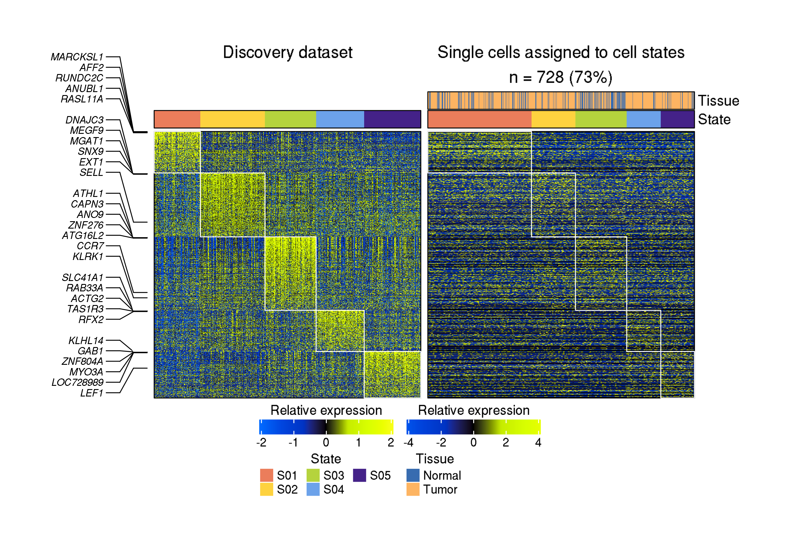
```


-   If the statistical significance quantification method is applied,
    the resulting z-score for each cell state are output in the same
    directory:

``` r
#data = read.delim("RecoveryOutput/scRNA_lymphoma_data/B.cells/recovery_z_scores.txt")
#head(data[,c("State", "Z")])
```

Since in this case the annotation file did not contain a column called
*Sample*, ecotype recovery was not performed.

## **Tutorial 3:** Recovery of Cell States and Ecotypes in Spatial Transcriptomics data

EcoTyper comes pre-loaded with the resources necessary for the
reference-guided recovery of cell states and ecotypes previously defined
in carcinoma and lymphoma, in user-provided expression data. The
recovery procedure described in this tutorial can also be applied on
user-defined cell states and ecotypes, derived as described in Tutorials
4-6.

Here we illustrate how one can perform cell state and ecotype recovery
in Visium Spatial Gene Expression arrays from [10x
Genomics](https://www.10xgenomics.com/products/spatial-gene-expression).
For this tutorial we recover cell states and ecotypes defined across
carcinomas in whole transcriptome spatial transcriptomics data from
[breast
cancer](https://support.10xgenomics.com/spatial-gene-expression/datasets/1.1.0/V1_Breast_Cancer_Block_A_Section_1).

### 3.1. Checklist before performing cell states and ecotypes recovery in Visium data

In order for EcoTyper to perform cell states and ecotypes recovery in
Visium data, the following resources need to be available:

-   the filtered feature-barcode matrices `barcodes.tsv.gz`,
    `features.tsv.gz` and `matrix.mtx.gz`, in the format provided by
    [10x
    Genomics](https://support.10xgenomics.com/spatial-gene-expression/software/pipelines/latest/output/matrices),
    and the `tissue_positions_list.csv` file produced by the [run
    summary images
    pipeline](https://support.10xgenomics.com/spatial-gene-expression/software/pipelines/latest/output/images),
    containing the spatial position of barcodes.

-   if the major cell populations expected in the system to be analyzed
    **are** recapitulated by the cell populations analyzed in the
    EcoTyper carcinoma paper (B cells, CD4 T cells, CD8 T cells,
    dendritic cells, endothelial cells, epithelial cells, fibroblasts,
    mast cells, monocytes/macrophages, NK cells, plasma cells,
    neutrophils), or the EcoTyper lymphoma paper (B cells, CD4 T cells,
    CD8 T cells, follicular helper T cells, Tregs, dendritic cells,
    endothelial cells, fibroblasts, mast cells, monocytes/macrophages,
    NK cells, plasma cells, neutrophils), then the user needs:

    -   Docker

    -   Docker containers for **CIBERSORTx Fractions** and **CIBERSORTx
        HiRes** modules, both of which can be obtained from the
        [CIBERSORTx website](https://cibersortx.stanford.edu/). Please
        follow the instructions from the website to install them.

    -   A token required for running the docker containers, which can
        also be obtained from the [CIBERSORTx
        website](https://cibersortx.stanford.edu/download.php).

-   if the major cell populations expected in the system to be analyzed
    **are not** recapitulated by the cell populations analyzed in the
    EcoTyper carcinoma paper (B cells, CD4 T cells, CD8 T cells,
    dendritic cells, endothelial cells, epithelial cells, fibroblasts,
    mast cells, monocytes/macrophages, NK cells, plasma cells,
    neutrophils), or the EcoTyper lymphoma paper (B cells, CD4 T cells,
    CD8 T cells, follicular helper T cells, Tregs, dendritic cells,
    endothelial cells, fibroblasts, mast cells, monocytes/macrophages,
    NK cells, plasma cells, neutrophils), then the user needs to provide
    their own cell type proportion estimations for these populations
    (see more details below).

The script that does cell type and ecotype discovery is:

``` bash
Rscript EcoTyper_recovery_visium.R -h
```

    ## usage: EcoTyper_recovery_visium.R [-c <PATH>] [-h]
    ## 
    ## Arguments:
    ##   -c <PATH>, --config <PATH>
    ##                         Path to the config files [required].
    ##   -h, --help            Print help message.

### 3.2. The configuration file

This script takes as input file a configuration file in
[YAML](https://yaml.org/) format. The configuration file for this
tutorial is available in `config_recovery_visium.yml`:

``` yaml
default :
  Input :
    Discovery dataset name : "Carcinoma"
    Recovery dataset name : "VisiumBreast"
    Input Visium directory : "example_data/VisiumBreast"
    #Path to a file containing the precomputed cell fractions for the visium array
    Recovery cell type fractions : "NULL"
    Malignant cell of origin : "Epithelial.cells"
    CIBERSORTx username : "<Please use your username from the CIBERSORTx website>"
    CIBERSORTx token : "<Please obtain a token from the CIBERSORTx website>"

  Output :
    Output folder : "VisiumOutput"

  Pipeline settings :
    Number of threads : 10
```

The configuration file has three sections, *Input*, *Pipeline settings*,
and *Output*. We next will describe the expected content in each of
these sections, and instruct the user how to set the appropriate
settings in their applications.

#### Input section

The *Input* section contains settings regarding the input data.

#### Discovery dataset name

``` yaml
Discovery dataset name : "Carcinoma"
```

*Discovery dataset name* should contain the name of the discovery
dataset used for defining cell states. By default, the only accepted
values are *Carcinoma* and *Lymphoma* (case sensitive), which will
recover the cell states that we defined across carcinomas and in
lymphoma, respectively. If the user defined cell states in their own
data (**Tutorials 4-6**), the name of the discovery dataset is the value
provided in the *Discovery dataset name* field of the configuration file
used for running discovery. For this tutorial, we set the name of the
discovery dataset to *Carcinoma*.

#### Recovery dataset name

``` yaml
Recovery dataset name : "VisiumBreast"
```

*Recovery dataset name* is the identifier used by EcoTyper to internally
save and retrieve the information about the cell states/ecotypes
abundances. Any value that contains alphanumeric characters and ’\_’ is
accepted for this field.

#### Input Visium directory

``` yaml
Input Visium directory : "example_data/VisiumBreast"
```

There are 4 input files needed for recovery on the visium data:

``` r
list.files("example_data/VisiumBreast")
```

    ## [1] "barcodes.tsv.gz"           "features.tsv.gz"          
    ## [3] "matrix.mtx.gz"             "tissue_positions_list.csv"

The filtered feature-barcode matrices `barcodes.tsv.gz`,
`features.tsv.gz` and `matrix.mtx.gz`, in the format provided by [10x
Genomics](https://support.10xgenomics.com/spatial-gene-expression/software/pipelines/latest/output/matrices),
and the `tissue_positions_list.csv` file produced by the [run summary
images
pipeline](https://support.10xgenomics.com/spatial-gene-expression/software/pipelines/latest/output/images),
containing the spatial position of barcodes.

#### Recovery cell type fractions

``` yaml
Recovery cell type fractions : "NULL"
```

*Recovery cell type fractions* should contain the path to a file
containing the cell type fraction estimations for each spot on the
visium array. This field is ignored when the discovery dataset is
*Carcinoma* or *Lymphoma* or when the discovery has been performed as
described in [*Tutorial
4*](#tutorial-4-de-novo-discovery-of-cell-states-and-ecotypes-in-bulk-data),
using *Carcinoma_Fractions* or *Lymphoma_Fractions*. It is only used
when users provided their own cell type fractions for deriving cell
states and ecotypes in [*Tutorial
4*](#tutorial-4-de-novo-discovery-of-cell-states-and-ecotypes-in-bulk-data).
In this case, the user needs to provide a path to a tab-delimited file
for this field. The file should contain in the first column the same
sample names used as column names in the input expression matrix, and in
the next columns, the cell type fractions for the same cell populations
used for discovering cell states and ecotypes. These fractions should
sum up to 1 for each row. An example of such a file is provided in:

``` r
data = read.delim("example_data/visium_fractions_example.txt", nrow = 5)
dim(data)
```

    ## [1]  5 13

``` r
data
```

    ##              Mixture Fibroblasts Endothelial.cells Epithelial.cells    B.cells
    ## 1 AAACAAGTATCTCCCA.1   0.3747796       0.016948078        0.2164860 0.04116797
    ## 2 AAACACCAATAACTGC.1   0.1231510       0.028426736        0.6737582 0.02209104
    ## 3 AAACAGAGCGACTCCT.1   0.2383718       0.085296697        0.3124031 0.03159104
    ## 4 AAACAGGGTCTATATT.1   0.1178922       0.053757339        0.1128586 0.11847960
    ## 5 AAACAGTGTTCCTGGG.1   0.3699561       0.005238928        0.5008316 0.01311040
    ##   CD4.T.cells CD8.T.cells Dendritic.cells  Mast.cells Monocytes.and.Macrophages
    ## 1  0.10447645 0.033647446     0.016196773 0.021842932                0.06183330
    ## 2  0.04376232 0.025219723     0.006647209 0.008375436                0.03087553
    ## 3  0.04581258 0.028235504     0.025698640 0.020992271                0.04386487
    ## 4  0.11018235 0.154411312     0.004780762 0.013200087                0.09278191
    ## 5  0.02826441 0.007037966     0.005238555 0.006979820                0.02851720
    ##      NK.cells        PCs        PMNs
    ## 1 0.030228865 0.06911276 0.013279833
    ## 2 0.006960189 0.02580987 0.004922716
    ## 3 0.020617429 0.13918007 0.007936014
    ## 4 0.000000000 0.21863726 0.003018626
    ## 5 0.007854087 0.02484208 0.002128834

Since in this tutorial we use the *Carcinoma* dataset as the discovery
dataset, this field is not required. However, if it needs to be
provided, it can be set as follows:

``` yaml
Recovery cell type fractions : "example_data/visium_fractions_example.txt"
```

#### Malignant cell of origin

``` yaml
Malignant cell of origin : "Epithelial.cells"
```

The cell of origin population for the cancer type being analyzed,
amongst the cell types used for discovery. This field is used for
plotting a gray background in the resulting output plot, with the
intensity of gray depicting the abundance of the cell of origin
population in each spot. It is not used when the discovery dataset is
*Carcinoma* or *Lymphoma* or when the discovery has been performed as
described in *Tutorials 4-6*, using *Carcinoma_Fractions* or
*Lymphoma_Fractions*. In these cases, the malignant cells are
automatically considered to be originating from *Epithelial.cells* or
*B.cells*, respectively. Otherwise, this field needs to contain a column
name in the file provided in *Recovery cell type fractions* field,
corresponding to the appropriate cell type of origin.

#### CIBERSORTx username and token

``` yaml
CIBERSORTx username : "<Please use your username from the CIBERSORTx website>"
CIBERSORTx token : "<Please obtain a token from the CIBERSORTx website>"
```

The fields **CIBERSORTx username** and **CIBERSORTx token** should
contain the username on the CIBERSORTx website and the token necessary
to run the CIBERSORTx source code. The token can be obtained from the
[CIBERSORTx website](https://cibersortx.stanford.edu/download.php).

#### The output section

The *Output* section contains a single field, *Output folder*, which
specifies the path where the final output will be saved. This folder
will be created if it does not exist.

``` yaml
Output folder : "VisiumOutput"
```

#### Number of threads

The last section, *Pipeline settings*, contains only one argument, the
number of threads used for performing recovery:

``` yaml
Number of threads : 10
```

### 3.3. The command line

After editing the configuration file (`config_recovery_visium.yml`), the
command line for recovering the cell states and ecotypes in Visium
Spatial Gene Expression data looks as illustrated below. Please note
that this script might take up to two hours to run on 10 threads. Also,
since CIBERSORTx is run on each spot, the memory requirements might
exceed the memory available on a typical laptop. We recommend that this
tutorial is run on a server with \>32GB of RAM.

``` r
Rscript EcoTyper_recovery_visium.R -c config_recovery_visium.yml
```

### 3.4. The output format

EcoTyper generates for each cell type the following outputs:

-   Cell state abundances:

``` r
data = read.delim("VisiumOutput/VisiumBreast/state_abundances.txt")
dim(data)
```

    ## [1] 3813   59

``` r
head(data[,1:10])
```

    ##                   ID  X   Y       Sample Malignant B.cells_S01 B.cells_S02
    ## 1 AAACAAGTATCTCCCA.1 50 102 VisiumBreast 0.2164860     0.93234   0.0000000
    ## 2 AAACACCAATAACTGC.1 59  19 VisiumBreast 0.6737582     0.00000   0.5003005
    ## 3 AAACAGAGCGACTCCT.1 14  94 VisiumBreast 0.3124031     0.00000   0.0000000
    ## 4 AAACAGGGTCTATATT.1 47  13 VisiumBreast 0.1128586     1.00000   0.0000000
    ## 5 AAACAGTGTTCCTGGG.1 73  43 VisiumBreast 0.5008316     0.00000   0.2969141
    ## 6 AAACATTTCCCGGATT.1 61  97 VisiumBreast 0.7553180     0.00000   0.3589368
    ##   B.cells_S03 B.cells_S04 CD4.T.cells_S01
    ## 1           0           0               0
    ## 2           0           0               0
    ## 3           0           0               0
    ## 4           0           0               1
    ## 5           0           0               0
    ## 6           0           0               0

-   Plots illustrating the cell state abundance across state from each
    cell type. The intensity of charcoal represents the cell state
    abundance. The intensity of gray represents the fraction of the
    cancer cell of origin population:

``` r
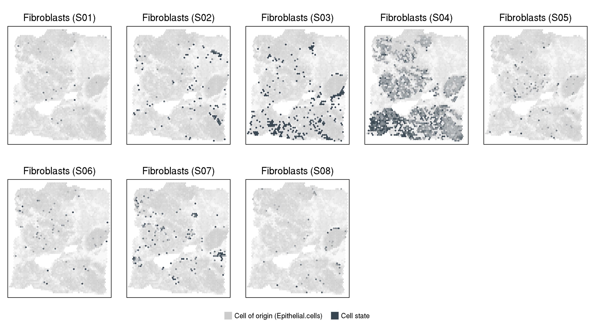
```


-   Ecotype abundances:

``` r
data = read.delim("VisiumOutput/VisiumBreast/ecotype_abundances.txt")
dim(data)
```

    ## [1] 3813   13

``` r
head(data[,1:10])
```

    ##                                ID  X   Y       Sample Malignant        E1
    ## VisiumBreast.1 AAACAAGTATCTCCCA.1 50 102 VisiumBreast 0.1142685 0.0000000
    ## VisiumBreast.2 AAACACCAATAACTGC.1 59  19 VisiumBreast 0.7334114 0.3751726
    ## VisiumBreast.3 AAACAGAGCGACTCCT.1 14  94 VisiumBreast 0.2441395 0.0000000
    ## VisiumBreast.4 AAACAGGGTCTATATT.1 47  13 VisiumBreast 0.0000000 0.4173973
    ## VisiumBreast.5 AAACAGTGTTCCTGGG.1 73  43 VisiumBreast 0.4992702 0.2870171
    ## VisiumBreast.6 AAACATTTCCCGGATT.1 61  97 VisiumBreast 0.8438427 0.1124896
    ##                       E2        E3        E4        E5
    ## VisiumBreast.1 0.0000000 0.0000000 0.5014347 0.3590839
    ## VisiumBreast.2 0.9696322 0.0000000 0.0000000 0.4942756
    ## VisiumBreast.3 0.0000000 0.0000000 0.0000000 0.0000000
    ## VisiumBreast.4 0.6267933 0.0000000 0.0000000 0.6267933
    ## VisiumBreast.5 0.1185850 0.0000000 0.5014347 0.0000000
    ## VisiumBreast.6 0.0000000 0.1890679 0.0000000 0.3792658

-   Plots illustrating the ecotype abundances. The intensity of charcoal
    represents the cell state abundance. The intensity of gray
    represents the fraction of the cancer cell of origin population:

``` r
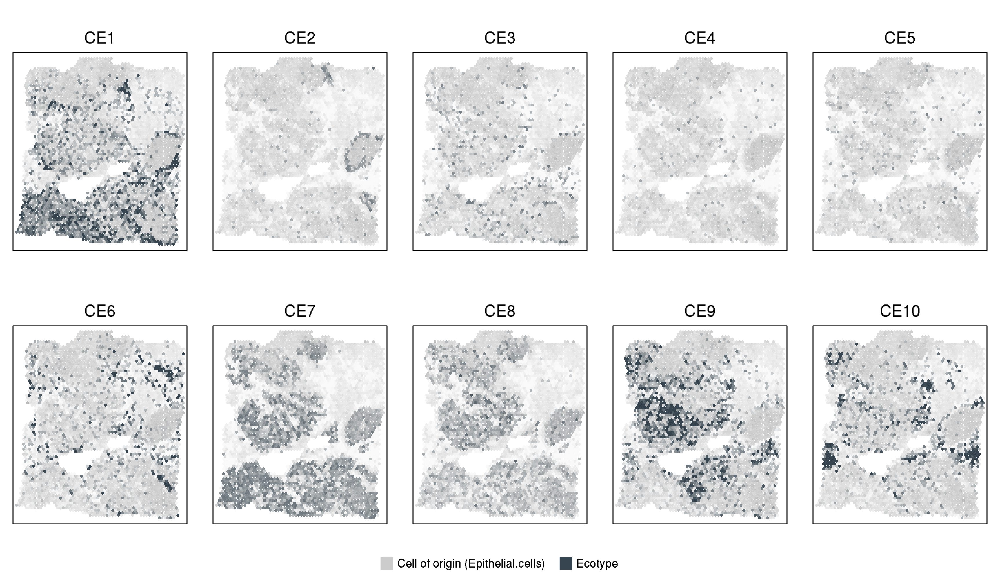
```


## **Tutorial 4.** *De novo* Discovery of Cell States and Ecotypes in Bulk Data

In this tutorial we illustrate how one can perform *de novo*
identification of cell states and ecotypes, starting from a bulk-tissue
expression matrix. For illustration purposes, we use as discovery
dataset a downsampled version of the TCGA samples from lung
adenocarcinoma (LUAD) and lung squamous cell carcinoma (LUSC), available
in `example_data/bulk_lung_data.txt`, together with the sample
annotation file `example_data/bulk_lung_annotation.txt`.

### 4.1. Overview of the EcoTyper workflow for discovering cell states

EcoTyper derives cell states and ecotypes in a sequence of steps:

1.  **Cell type fraction estimation**: EcoTyper relies on cell abundance
    estimations of the major cell lineages expected to be present in the
    tissue analyzed, for each sample in the discovery dataset. <br/> One
    way of estimating cell type abundances in bulk tissue specimens is
    by using *CIBERSORTx Fractions* module. *CIBERSORTx Fractions*
    leverages sets of barcode genes, termed *signature matrix*, to
    estimate cell fractions. Complete tutorials about how signature
    matrices can be derived are available on the [CIBERSORTx
    website](https://cibersortx.stanford.edu/tutorial.php). In the
    EcoTyper carcinoma and lymphoma papers, we serially apply two
    signature matrices, to get a comprehensive representation of cell
    types typically found in these malignancies. We make these
    strategies automatically available in EcoTyper. If, however, the
    tissue/system being analyzed is expected to have different cell
    populations, then the user needs to estimate the appropriate
    fractions themselves (see details below).

2.  **Cell type expression purification**: To impute cell type-specific
    gene expression profiles from bulk tissue transcriptomes, EcoTyper
    employs CIBERSORTx HiRes module. CIBERSORTx HiRes takes as input the
    bulk expression matrix of the discovery dataset and the fractions of
    the cell populations obtained at step 1. It produces cell-type
    specific expression profiles, at single-sample resolution, for each
    cell population.

3.  **Cell state discovery**: EcoTyper leverages nonnegative matrix
    factorization (NMF) to identify transcriptionally-defined cell
    states from expression profiles purified by CIBERSORTx HiRes (step
    2). Given c cell types, let
     be a
    
    cell type-specific expression matrix for cell type
     consisting
    of  rows
    (the number of genes) and
     columns
    (the number of samples). The primary objective of NMF is to
    factorize
     into
    two non-negative matrices: a
    
    matrix, ,
    and a
    
    matrix, ,
    where  is a
    user-specified rank (i.e., number of clusters). The basis matrix,
    , encodes a
    representative expression level for each gene in each cell state.
    The mixture coefficients matrix
    , scaled to
    sum to 1 across cell states, encodes the representation (relative
    abundance) of each cell state in each sample. <br/> EcoTyper applies
    NMF on the top 1000 genes with highest relative dispersion across
    samples. If less than 1000 genes are available, all genes are
    selected. If less than 50 genes are imputed for a given cell type,
    that cell type is not used for cell state identification. Prior to
    NMF, each gene is scaled to mean 0 and unit variance. To satisfy the
    non-negativity requirement of NMF, cell type-specific expression
    matrices are individually processed using *posneg* transformation.
    This function converts an input expression matrix
     into
    two matrices, one containing only positive values and the other
    containing only negative values with the sign inverted. These two
    matrices are subsequently concatenated to produce
    .
    <br/> For each cell type, EcoTyper applies NMF across a range of
    ranks (number of cell states), by default 2-20 states. For each
    rank, the NMF algorithm is applied multiple times (we recommend at
    least 50) with different starting seeds, for robustness.

4.  **Choosing the number of cell states**: Cluster (state) number
    selection is an important consideration in NMF applications. We
    found that previous approaches that rely on minimizing error
    measures (e.g., RMSE, KL divergence) or optimizing
    information-theoretic metrics either failed to converge or were
    dependent on the number of genes imputed. In contrast, the
    cophenetic coefficient quantifies the classification stability for a
    given rank (i.e., the number of clusters) and ranges from 0 to 1,
    with 1 being maximally stable. While the rank at which the
    cophenetic coefficient starts decreasing is typically selected, this
    approach is challenging to apply in situations where the cophenetic
    coefficient exhibits a multi-modal shape across ranks, as we found
    for some cell types. Therefore, we developed a heuristic approach
    more suitable for such settings. In each case, the rank was
    automatically chosen based on the cophenetic coefficient evaluated
    in the range 2–20 clusters (by default). Specifically, we determined
    the first occurrence in the interval 2–20 for which the cophenetic
    coefficient dropped below 0.95 (by default), having been above this
    level for at least two consecutive ranks. We then selected the rank
    immediately adjacent to this crossing point which was closest to
    0.95 (by default).

5.  **Extracting cell state information**: The NMF output resulting from
    step 4 is parsed and cell state information is extracted for the
    downstream analyses.

6.  **Cell state QC filter**: Although posneg transformation is required
    to satisfy the non-negativity constraint of NMF following
    standardization, it can lead to the identification of spurious cell
    states driven by features with more negative values than positive
    ones. To combat this, we devised an adaptive false positive index
    (AFI), a novel index defined as the ratio between the sum of weights
    from the W matrix corresponding to the negative and positive
    features. EcoTyper automatically filters the states with
    .

7.  **Advanced cell state QC filter**: When the discovery dataset is
    comprised of multiple tumor types, we recommend using this advanced
    filter. This filter identifies poor-quality cell states using a
    dropout score, which flags states whose marker genes exhibit
    anomalously low variance and high expression across the discovery
    cohort, generally an artefact of CIBEROSRTx HiRes. To calculate the
    dropout score for each marker gene (i.e., genes with maximal log2
    fold change in each state relative to other states within a given
    cell type), EcoTyper determines the maximum fraction of samples for
    which the gene has the same value. It also calculates the average
    log2 expression of the gene across samples. It averages each
    quantity, scaled to unit variance across states, within each state,
    converts them to z-scores, and removes states with a mean Z >1.96 (P
    \< 0.05).

8.  **Ecotype (cellular community) discovery**: *Ecotypes* or *cellular
    communities* are derived by identifying patterns of co-occurrence of
    cell states across samples. First, EcoTyper leverages the Jaccard
    index to quantify the degree of overlap between each pair of cell
    states across samples in the discovery cohort. Toward this end, it
    discretizes each cell state
     into a
    binary vector
     of length
    , where
     denotes
    the number of samples in the discovery cohort. Collectively, these
    vectors comprise binary matrix
    , with same
    number of rows as cell states across cell types and
     columns
    (samples). Given sample
    , if state
     is the
    most abundant state among all states in cell type
    , EcoTyper
    sets
    ")
    to 1; otherwise
     ← 0").
    It then computes all pairwise Jaccard indices on the rows (states)
    in matrix ,
    yielding matrix
    . Using the
    hypergeometric test, it evaluates the null hypothesis that any given
    pair of cell states
     and
     have no
    overlap. In cases where the hypergeometric p-value is >0.01, the
    Jaccard index for
    ")
    is set to 0 (i.e., no overlap). To identify communities while
    accommodating outliers, the updated Jaccard matrix
    
    is hierarchically clustered using average linkage with Euclidean
    distance (hclust in the R stats package). The optimal number of
    clusters is then determined via silhouette width maximization.
    Clusters with less than 3 cell states are eliminated from further
    analysis.

### 4.2. Checklist before performing cell states and ecotypes discovery

In order for EcoTyper to perform cell states and ecotypes discovery, the
following resources need to be available:

-   docker containers for **CIBERSORTx Fractions** and **CIBERSORTx
    HiRes** modules, both of which can be obtained from the [CIBERSORTx
    website](https://cibersortx.stanford.edu/). Please follow the
    instructions from the website to install them.

-   a token required for running the docker containers, which can also
    be obtained from the [CIBERSORTx
    website](https://cibersortx.stanford.edu/download.php).

-   a user-provided bulk tissue expression matrix (RNA-seq or
    microarray), on which the discovery will be performed (a discovery
    cohort). For this tutorial, we will use the example data in
    `example_data/bulk_lung_data.txt`.

-   if the major cell populations expected in the system to be analyzed
    are **not** recapitulated by the cell populations analyzed in the
    EcoTyper carcinoma paper (B cells, CD4 T cells, CD8 T cells,
    dendritic cells, endothelial cells, epithelial cells, fibroblasts,
    mast cells, monocytes/macrophages, NK cells, plasma cells,
    neutrophils), or the EcoTyper lymphoma paper (B cells, CD4 T cells,
    CD8 T cells, follicular helper T cells, Tregs, dendritic cells,
    endothelial cells, fibroblasts, mast cells, monocytes/macrophages,
    NK cells, plasma cells, neutrophils), then the user needs to provide
    their own cell type proportion estimations for these populations
    (see more details below).

-   optionally, a sample annotation file, such as the one provided in
    `example_data/bulk_lung_annotation.txt`, can be supplied to
    EcoTyper. The information in this file can be used for heatmap
    plotting purposes, and also to instruct EcoTyper to find cell
    states/ecotypes common across different biological batches
    (e.g. tumor types), as detailed below.

### 4.3. Cell states and ecotypes discovery

The script that does cell type and ecotype discovery is:

``` bash
Rscript EcoTyper_discovery_bulk.R -h
```

    ## usage: EcoTyper_discovery_bulk.R [-c <PATH>] [-h]
    ## 
    ## Arguments:
    ##   -c <PATH>, --config <PATH>
    ##                         Path to the config files [required].
    ##   -h, --help            Print help message.

This script takes as input file a configuration file in
[YAML](https://yaml.org/) format. The configuration file for this
tutorial is available in `config_discovery_bulk.yml`:

``` yaml
default :
  Input :
    Discovery dataset name : "MyDiscovery"
    Expression matrix : "example_data/bulk_lung_data.txt"
    #Possible values: "Carcinoma_Fractions", "Lymphoma_Fractions" or a path to a file containing the precomputed cell fractions
    Cell type fractions : "Carcinoma_Fractions"
    #Possible values: "RNA-seq", "Affymetrix", "Other"
    Expression type : "RNA-seq"
    #This field can also be set to "NULL"
    Annotation file : "example_data/bulk_lung_annotation.txt"
    #This field can also be set to "NULL"
    Annotation file column to scale by : "Histology"
    #This field can also be set to "NULL"
    Annotation file column(s) to plot : ["Histology", "Tissue"]
    CIBERSORTx username : "<Please use your username from the CIBERSORTx website>"
    CIBERSORTx token : "<Please obtain a token from the CIBERSORTx website>"

  Output :
    Output folder : "DiscoveryOutput"

  Pipeline settings :
    #Pipeline steps:
    #   step 1 (cell type fraction estimation)
    #   step 2 (cell type expression purification)
    #   step 3 (cell state discovery)
    #   step 4 (choosing the number of cell states)
    #   step 5 (extracting cell state information)
    #   step 6 (cell state QC filter)
    #   step 7 (advanced cell state QC filter)
    #   step 8 (ecotype discovery)
    Pipeline steps to skip : [7] # by default, step 7 is skipped
    Number of threads : 10
    Number of NMF restarts : 5
    Maximum number of states per cell type : 20
    Cophenetic coefficient cutoff : 0.95
```

The configuration file has three sections, *Input*, *Output* and
*Pipeline settings*. We next will describe the expected content in each
of these three sections, and instruct the user how to set the
appropriate settings in their applications.

#### Input section

The *Input* section contains settings regarding the input data.

#### Discovery dataset name

*Discovery dataset name* is the identifier used by EcoTyper to
internally save and retrieve the information about the cell
states/ecotypes defined on this discovery dataset. It is also the name
to be provided to the *-d*/*–discovery* argument of scripts
`EcoTyper_recovery_scRNA.R` and `EcoTyper_recovery_bulk.R`, when
performing cell state/ecotypes recovery. Any value that contains
alphanumeric characters and ’\_’ is accepted for this field.

``` yaml
Discovery dataset name : "MyDiscovery"
```

#### Expression matrix

``` yaml
Expression matrix : "example_data/bulk_lung_data.txt"
```

*Expression matrix* field should contain the path to a tab-delimited
file containing the expression data, with genes as rows and samples as
columns. The expression matrix should be in the TPM or FPKM space for
bulk RNA-seq and **non-logarithmic** (exponential) space for
microarrays. It should have gene symbols on the first column and gene
counts for each sample on the next columns. Column (sample) names should
be unique. Also, we recommend that the column names do not contain
special characters that are modified by the R function *make.names*,
*e.g.* having digits at the beginning of the name or containing
characters such as *space*, *tab* or *-*:

The expected format for the expression matrix is:

``` r
data = read.delim("example_data/bulk_lung_data.txt", nrow = 5)
dim(data)
```

    ## [1]   5 251

``` r
head(data[,1:5])
```

    ##      Gene TCGA.37.A5EN.01A.21R.A26W.07 TCGA.37.4133.01A.01R.1100.07
    ## 1    A1BG                   18.6400165                 18.196602709
    ## 2    A1CF                    0.0338368                  0.002095014
    ## 3     A2M                   54.1463351                 35.714991125
    ## 4   A2ML1                    4.9953315                  2.383752067
    ## 5 A3GALT2                    0.0438606                  0.000000000
    ##   TCGA.77.7465.01A.11R.2045.07 TCGA.34.5240.01A.01R.1443.07
    ## 1                  24.83635354                 23.579201761
    ## 2                   0.02301987                  0.004186634
    ## 3                  80.63633736                 86.804257397
    ## 4                   4.08688641                  3.015307103
    ## 5                   0.00000000                  0.000000000

#### Cell type fractions

*Cell type fractions* field instructs EcoTyper on how to compute cell
type fractions on the discovery dataset:

``` yaml
#Possible values: "Carcinoma_Fractions", "Lymphoma_Fractions" or a path to a file containing the precomputed cell fractions
Cell type fractions : "Carcinoma_Fractions"
```

If the major cell populations expected in the user-provided discovery
dataset are recapitulated by the cell populations analyzed in the
EcoTyper carcinoma paper (B cells, CD4 T cells, CD8 T cells, dendritic
cells, endothelial cells, epithelial cells, fibroblasts, mast cells,
monocytes/macrophages, NK cells, plasma cells and neutrophils), then
this field can be set to **Carcinoma_Fractions** (case sensitive), and
EcoTyper will automatically estimate fractions for these populations, in
step 1 of the workflow. Similarly, if the cell populations analyzed in
the EcoTyper lymphoma paper (B cells , CD4 T cells, CD8 T cells,
follicular helper T cells, Tregs, dendritic cells, endothelial cells,
fibroblasts, mast cells, monocytes/macrophages, NK cells, plasma cells
and neutrophils) are appropriate, then the user can set this field to
**Lymphoma_Fractions** and cell fractions will be automatically
calculated.

In each of these cases the fractions are being estimated by serially
applying two signature matrices on the discovery dataset. The first
signature matrix, denoted TR4, is available in
`utils/signature_matrices/TR4/TR4`. TR4 was obtained from FACS-sorted
profiles of epithelial cells (EPCAM+), fibroblasts (CD10+), endothelial
cells (CD31+) and immune cells (CD45+), obtained from lung cancer
specimens ([Newman et al., Nature Biotechnology
2019](https://www.nature.com/articles/s41587-019-0114-2)). The second
signature matrix, LM22, available in
`utils/signature_matrices/LM22/LM22`, was published with [Newman et al.,
Nature Methods 2015](https://www.nature.com/articles/nmeth.3337), and is
able to deconvolve 22 immune subsets. In the EcoTyper carcinoma paper,
we first collapse the fractions for 22 subsets to obtain the
representation of the 9 major cell types (B cells, plasma cells, CD4 T
cells, CD8 T cells, NK cells, monocytes/macrophages, dendritic cells,
mast cells, and neutrophils). We then replace the TR4 immune cell
fractions with the fractions of the 9 cell lineages. This way we obtain
cell abundance estimations for 12 cell populations used in that paper.
An analogous process is used to obtain the lymphoma fractions.

If neither of these cases apply, the user needs to provide a path to a
tab-delimited file containing the cell type proportion estimations for
the expected populations. The file should contain in the first column
the same sample names used for column names in the input expression
matrix, and in the next columns, the cell type fractions for each cell
population. These fractions should sum up to 1 for each row. An example
of such a file is provided in:

``` r
data = read.delim("example_data/bulk_fractions_example.txt", nrow = 5)
dim(data)
```

    ## [1]  5 13

``` r
data
```

    ##                        Mixture Fibroblasts Endothelial.cells Epithelial.cells
    ## 1 TCGA.05.4249.01A.01R.1107.07  0.04016289       0.014982782        0.7054344
    ## 2 TCGA.05.4397.01A.01R.1206.07  0.02267369       0.009185669        0.6347924
    ## 3 TCGA.05.4398.01A.01R.1206.07  0.07151019       0.012282375        0.4041580
    ## 4 TCGA.05.4410.01A.21R.1858.07  0.03624798       0.009184835        0.6380211
    ## 5 TCGA.05.5425.01A.02R.1628.07  0.02596008       0.016036916        0.5820677
    ##       B.cells CD4.T.cells CD8.T.cells Dendritic.cells  Mast.cells
    ## 1 0.007229603  0.03216195 0.009618405     0.040271214 0.037739587
    ## 2 0.008658565  0.03586357 0.018784902     0.017186200 0.010598134
    ## 3 0.008732240  0.11555398 0.031922166     0.017226963 0.009799286
    ## 4 0.010793538  0.04992778 0.042050615     0.001396051 0.006484677
    ## 5 0.010044434  0.06866075 0.055325719     0.009598804 0.007838445
    ##   Monocytes.and.Macrophages    NK.cells        PCs        PMNs
    ## 1                0.08498321 0.003858362 0.02000494 0.003552648
    ## 2                0.20940083 0.012661304 0.01555575 0.004638961
    ## 3                0.25249613 0.013547285 0.05768268 0.005088728
    ## 4                0.11240034 0.008568742 0.08322750 0.001696815
    ## 5                0.17408990 0.012115993 0.03057943 0.007681873

This path can provided in the configuration file as follows:

``` yaml
#Possible values: "Carcinoma_Fractions", "Lymphoma_Fractions" or a path to a file containing the precomputed cell fractions
Cell type fractions : "example_data/bulk_fractions_example.txt"
```

#### Expression type

``` yaml
 #Possible values: "RNA-seq", "Affymetrix", "Other"
    Expression type : "RNA-seq"
```

*Expression type* field specifies the platform used to generate the data
provided in the expression matrix. The accepted values are **RNA-seq**
for bulk RNA-seq data, **Affymetrix** for data profiled using Affymetrix
microarray platforms, and **Other** for data from non-Affymetrix
microarray platform. This argument is relevant only if the cell type
fractions are being estimated automatically by EcoTyper (i.e. values
**Carcinoma_Fractions** or **Lymphoma_Fractions** are being provided in
the field **Cell type fractions** of the configuration file, as
described above). Based on this field, EcoTyper determines the
appropriate parameters for the CIBERSORTx fractions module, when
estimating cell type fractions using the TR4 and LM22 signatures (see
above). If **RNA-seq** is provided, CIBERSORTx with no batch correction
is applied on TR4 and with B-mode batch correction on LM22. If
**Affymetrix** is provided CIBERSORTx fractions with B-mode batch
correction is applied on TR4 and with no batch correction on LM22. If
**Other** is provided, CIBERSORTx fractions with B-mode batch correction
is applied on both signatures

#### Annotation file

``` yaml
Annotation file : "example_data/bulk_lung_annotation.txt"
```

A path to an annotation file can be provided in the field *Annotation
file*. If provided, this file should contain a column called **ID** with
the same names as the columns of the expression matrix, and any number
of additional columns. The additional columns can be used for defining
sample batches (see Section *Annotation file column to scale by* below)
and for plotting color bars in the heatmaps output (see Section
*Annotation file column(s) to plot* below). If not provided, this field
needs to be set to **“NULL”**. For the current example, the annotation
file has the following format:

``` r
annotation = read.delim("example_data/bulk_lung_annotation.txt", nrow = 5)
dim(annotation)
```

    ## [1] 5 6

``` r
head(annotation)
```

    ##                             ID Tissue Histology                Type OS_Time
    ## 1 TCGA.37.A5EN.01A.21R.A26W.07  Tumor      LUSC Primary Solid Tumor     660
    ## 2 TCGA.37.4133.01A.01R.1100.07  Tumor      LUSC Primary Solid Tumor     238
    ## 3 TCGA.77.7465.01A.11R.2045.07  Tumor      LUSC Primary Solid Tumor     990
    ## 4 TCGA.34.5240.01A.01R.1443.07  Tumor      LUSC Primary Solid Tumor    1541
    ## 5 TCGA.05.4249.01A.01R.1107.07  Tumor      LUAD Primary Solid Tumor    1523
    ##   OS_Status
    ## 1         0
    ## 2         0
    ## 3         0
    ## 4         0
    ## 5         0

#### Annotation file column to scale by

``` yaml
Annotation file column to scale by : "Histology"
```

In order to discover pan-carcinoma cell states and ecotypes in the
EcoType carcinoma paper, we standardize genes to mean 0 and unit 1
*within* each tumor type (histology). Field *Annotation file column to
scale by* allows users to specify a column name in the annotation file,
by which the samples will be grouped when performing standardization.
The example discovery dataset used in this tutorial has samples from
lung adenocarcinoma and lung squamous cell carcinoma. Therefore, for
this tutorial we will use the **Histology** column to perform
standardization.

However, this is an analytical choice, depending on the purpose of the
analysis. If the users are interested in defining cell states and
ecotypes regardless of tumor type-specificity, this argument can be set
to **“NULL”**. In this case, the standardization will be applied across
all samples in the discovery cohort. The same will happen if the
annotation file is not provided.

#### Annotation file column(s) to plot

``` yaml
Annotation file column(s) to plot : ["Histology", "Tissue"]
```

*Annotation file column(s) to plot* field specifies which columns in the
annotation file will be used as color bar in the output heatmaps, in
addition to the cell state label or ecotype label column, plotted by
default.

#### CIBERSORTx username and token

``` yaml
CIBERSORTx username : "<Please use your username from the CIBERSORTx website>"
CIBERSORTx token : "<Please obtain a token from the CIBERSORTx website>"
```

The fields **CIBERSORTx username** and **CIBERSORTx token** should
contain the username on the CIBERSORTx website and the token necessary
to run the CIBERSORTx source code. The token can be obtained from the
[CIBERSORTx website](https://cibersortx.stanford.edu/getoken.php).

#### The output section

The *Output* section contains a single field, *Output folder*, which
specifies the path where the final output will be saved. This folder
will be created if it does not exist.

``` yaml
Output folder : "DiscoveryOutput"
```

#### Pipeline settings

The last section, *Pipeline settings*, contains settings controlling how
EcoTyper is run.

#### Pipeline steps to skip

``` yaml
 #Pipeline steps:
    #   step 1 (cell type fraction estimation)
    #   step 2 (cell type expression purification)
    #   step 3 (cell state discovery)
    #   step 4 (choosing the number of cell states)
    #   step 5 (extracting cell state information)
    #   step 6 (cell state QC filter)
    #   step 7 (advanced cell state QC filter)
    #   step 8 (ecotype discovery)
    Pipeline steps to skip : [7] # by default, step 7 is skipped
```

The *Pipeline steps to skip* option allows user to skip some of the
steps outlined in section *Overview of the EcoTyper workflow for
discovering cell states*. Please note that this option is only intended
for cases when the pipeline had already been run once, and small
adjustments are made to the parameters. For example, if the Cophenetic
coefficient cutoff used in step 3 needs adjusting, the user might want
to skip steps 1-2 and re-run from step 3 onwards.

#### Number of threads

``` yaml
Number of threads : 10
```

The number of threads EcoTyper will be run on.

#### Number of NMF restarts

``` yaml
Number of NMF restarts : 5
```

The NMF approach used by EcoTyper (Brunet et al.), can give slightly
different results, depending on the random initialization of the
algorithm. To obtain a stable solution, NMF is generally run multiple
times with different seeds, and the solution that best explains the
discovery data is chosen. Additionally, the variation of NMF solutions
across restarts with different seeds is quantified using Cophenetic
coefficients and used in step 4 of EcoTyper for selecting the number of
states. The parameter *Number of NMF restarts* specifies how many
restarts with different seed should EcoTyper perform for each rank
selection, in each cell type. Since this is a very time consuming
process, in this example we only use 5. **However, for
publication-quality results, we recommend at least 50 restarts**.

#### Maximum number of states per cell type

``` yaml
Maximum number of states per cell type : 20
```

**Maximum number of states per cell type** specifies the upper end of
the range for the number of states possible for each cell type. The
lower end is 2.

#### Cophenetic coefficient cutoff

``` yaml
Cophenetic coefficient cutoff : 0.95
```

This field indicates the Cophenetic coefficient cutoff, in the range
\[0, 1\], used for automatically determining the number of states in
step 4. Lower values generally lead to more clusters being identified.

### 4.4. The command line

After editing the configuration file (`config_discovery_bulk.yml`), the
*de novo* discovery cell states and ecotypes can be run as is
illustrated below. Please note that this script might take up to two
hours to run on 10 threads. Also, although EcoTyper can be run on the
example data from this tutorial using a typical laptop (16GB memory), it
might not be the case for larger datasets. We recommend that cell type
and ecotype discovery is generally run on a server with \>32GB of RAM.

``` r
Rscript EcoTyper_discovery_bulk.R -c config_discovery_bulk.yml
```

### 4.5. The output format

EcoTyper generates for each cell type the following outputs:

-   Plots displaying the Cophenetic coefficient calculated in step 4.
    The horizontal dotted line indicates the Cophenetic coefficient
    cutoff provided in the configuration file *Cophenetic coefficient
    cutoff* field. The vertical dotted red line indicates the number of
    states automatically selected based on the Cophenetic coefficient
    cutoff provided. We recommend that users inspect this file to make
    sure that the automatic selection provides sensible results. If the
    user wants to adjust the Cophenetic coefficient cutoff after
    inspecting this plot, they can rerun the discovery procedure
    skipping steps 1-3. **Please note that:**

    1.  **These plots indicate the number of states obtained before
        applying the filters for low-quality states in steps 6 and 7.
        Therefore, the final results will probably contain fewer
        states**.
    2.  **The plots below might look slightly different when generated
        with R versions other than R/3.6.0. This is because some
        EcoTyper steps, including NMF algorithm initialization, depend
        on random number generation. Althoguh EcoTyper sets random seeds
        before each such step, different R version output different
        random numbers for the same seed. To mitigate this issue, we
        recommend at least 50 NMF restarts when running EcoTyper**.

``` r
knitr::include_graphics("DiscoveryOutput/rank_plot.png")
```


-   For each cell type, the following outputs, exemplified here for
    endothelial cells, are produced:

    -   Abundances of cell states remaining after the QC filters in
        steps 6 and 7 (if run), across samples in the discovery dataset:

``` r
data = read.delim("DiscoveryOutput/Endothelial.cells/state_abundances.txt")
dim(data)
```

    ## [1]   4 250

``` r
head(data[,1:5])
```

    ##     TCGA.37.A5EN.01A.21R.A26W.07 TCGA.37.4133.01A.01R.1100.07
    ## S01                 4.657038e-15                 3.396931e-15
    ## S02                 4.313475e-01                 3.396931e-15
    ## S03                 4.657038e-15                 3.396931e-15
    ## S04                 5.532795e-02                 3.396931e-15
    ##     TCGA.77.7465.01A.11R.2045.07 TCGA.34.5240.01A.01R.1443.07
    ## S01                 4.011227e-15                 3.955821e-15
    ## S02                 2.750005e-01                 8.143772e-02
    ## S03                 4.011227e-15                 3.955821e-15
    ## S04                 4.011227e-15                 1.748715e-03
    ##     TCGA.05.4249.01A.01R.1107.07
    ## S01                 4.256051e-15
    ## S02                 4.256051e-15
    ## S03                 1.137231e-01
    ## S04                 8.575277e-01

-   Assignment of samples in the discovery dataset to the cell state
    with the highest abundance. Only samples assigned to the cell states
    remaining after the QC filters in steps 6 and 7 (if run) are
    included. The remaining ones are considered unassigned and removed
    from this table:

``` r
data = read.delim("DiscoveryOutput/Endothelial.cells/state_assignment.txt")
dim(data)
```

    ## [1] 131   3

``` r
head(data)
```

    ##                              ID State InitialState
    ## 31 TCGA.55.6983.11A.01R.1949.07   S01         IS02
    ## 32 TCGA.44.6776.11A.01R.1858.07   S01         IS02
    ## 33 TCGA.77.7335.11A.01R.2045.07   S01         IS02
    ## 34 TCGA.38.A44F.01A.11R.A24H.07   S01         IS02
    ## 35 TCGA.77.7138.11A.01R.2045.07   S01         IS02
    ## 36 TCGA.44.6778.11A.01R.1858.07   S01         IS02

-   A heatmap illustrating the expression of genes used for cell state
    discovery, that have the highest fold-change in one of the cell
    states remaining after the QC filters in steps 6 and 7 (if run). In
    the current example, the heatmap includes in the top color bar two
    rows corresponding to *Tissue* and *Histology*, that have been
    provided in configuration file field *Annotation file column(s) to
    plot*, in addition to cell state labels always plotted:

``` r
knitr::include_graphics("DiscoveryOutput/Endothelial.cells/state_assignment_heatmap.png")
```


The ecotype output files include:

-   The cell state composition of each ecotype (the set of cell states
    making up each ecotype):

``` r
ecotypes = read.delim("DiscoveryOutput/Ecotypes/ecotypes.txt")
head(ecotypes[,c("CellType", "State", "Ecotype")])
```

    ##            CellType State Ecotype
    ## 1           B.cells   S01      E1
    ## 2 Endothelial.cells   S02      E1
    ## 3  Epithelial.cells   S01      E1
    ## 4       Fibroblasts   S07      E1
    ## 5           B.cells   S03      E2
    ## 6       CD4.T.cells   S02      E2

-   The number of initial clusters obtained by clustering the Jaccard
    index matrix, selected using the average silhouette:

``` r
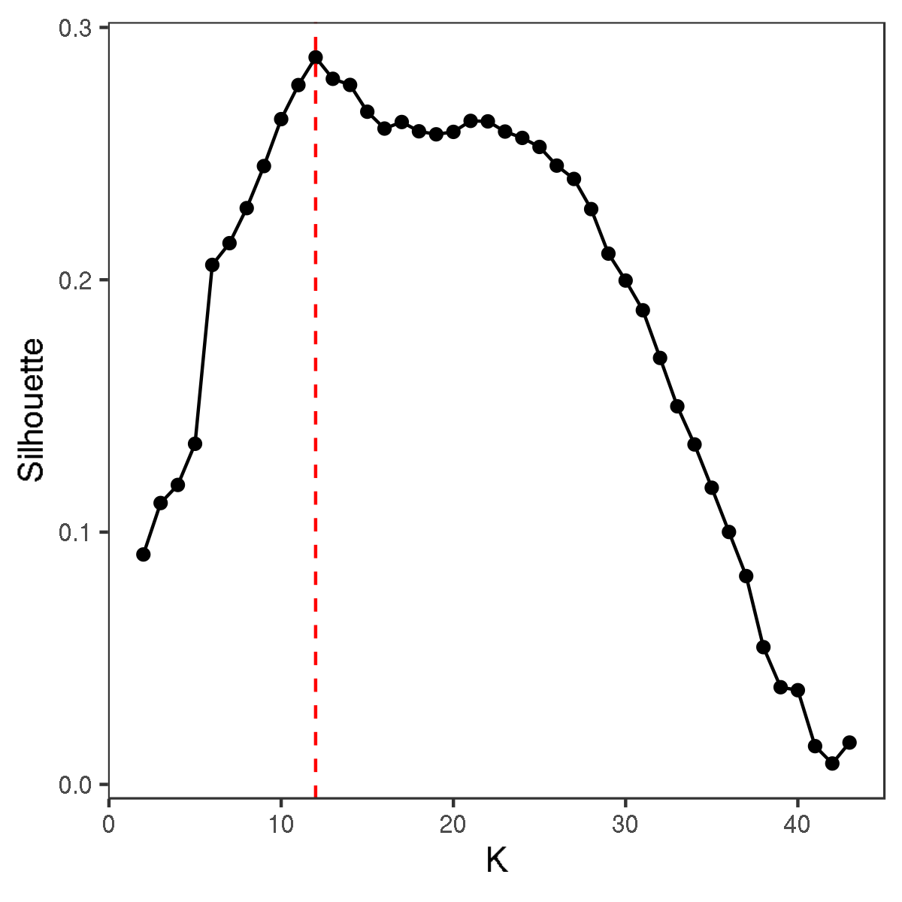
```


-   A heatmap of the Jaccard index matrix, after filtering ecotypes with
    less than 3 cell states:

``` r
knitr::include_graphics("DiscoveryOutput/Ecotypes/jaccard_matrix.png")
```


-   The abundance of each ecotype in each sample in the discovery
    dataset:

``` r
abundances = read.delim("DiscoveryOutput/Ecotypes/ecotype_abundance.txt")
dim(abundances)
```

    ## [1]   7 250

``` r
head(abundances[,1:5])
```

    ##    TCGA.37.A5EN.01A.21R.A26W.07 TCGA.37.4133.01A.01R.1100.07
    ## E1                  0.794531073                 5.587512e-02
    ## E2                  0.013996811                 7.309504e-02
    ## E3                  0.069214903                 6.880715e-03
    ## E4                  0.003306485                 6.049462e-03
    ## E5                  0.025837936                 1.759492e-14
    ## E6                  0.093112792                 8.580997e-01
    ##    TCGA.77.7465.01A.11R.2045.07 TCGA.34.5240.01A.01R.1443.07
    ## E1                 4.508978e-01                 9.485239e-01
    ## E2                 3.120952e-01                 2.957054e-03
    ## E3                 7.323729e-15                 1.835542e-03
    ## E4                 8.909708e-15                 1.377273e-02
    ## E5                 1.645593e-01                 7.296796e-15
    ## E6                 7.244779e-02                 3.291079e-02
    ##    TCGA.05.4249.01A.01R.1107.07
    ## E1                 4.493338e-09
    ## E2                 1.180982e-01
    ## E3                 5.358678e-01
    ## E4                 1.804165e-01
    ## E5                 8.538532e-02
    ## E6                 1.303634e-15

-   The assignment of samples in the discovery dataset to ecotypes. The
    samples not assigned to any ecotype are filtered out from this file:

``` r
assignments = read.delim("DiscoveryOutput/Ecotypes/ecotype_assignment.txt")
dim(assignments)
```

    ## [1] 190  11

``` r
head(assignments[,1:5])
```

    ##                                                        ID MaxEcotype
    ## TCGA.22.4613.01A.01R.1443.07 TCGA.22.4613.01A.01R.1443.07         E1
    ## TCGA.22.5471.01A.01R.1635.07 TCGA.22.5471.01A.01R.1635.07         E1
    ## TCGA.22.5473.01A.01R.1635.07 TCGA.22.5473.01A.01R.1635.07         E1
    ## TCGA.34.5240.01A.01R.1443.07 TCGA.34.5240.01A.01R.1443.07         E1
    ## TCGA.34.8456.01A.21R.2326.07 TCGA.34.8456.01A.21R.2326.07         E1
    ## TCGA.37.A5EM.01A.21R.A27Q.07 TCGA.37.A5EM.01A.21R.A27Q.07         E1
    ##                              AssignmentP AssignmentQ AssignedToEcotypeStates
    ## TCGA.22.4613.01A.01R.1443.07 0.006237509  0.02267708                    TRUE
    ## TCGA.22.5471.01A.01R.1635.07 0.011589892  0.03408792                    TRUE
    ## TCGA.22.5473.01A.01R.1635.07 0.173391227  0.21892832                    TRUE
    ## TCGA.34.5240.01A.01R.1443.07 0.073719200  0.12710207                    TRUE
    ## TCGA.34.8456.01A.21R.2326.07 0.002977868  0.01404655                    TRUE
    ## TCGA.37.A5EM.01A.21R.A27Q.07 0.027084554  0.06573921                    TRUE

-   A heatmap of cell state fractions across the samples assigned to
    ecotypes:

``` r
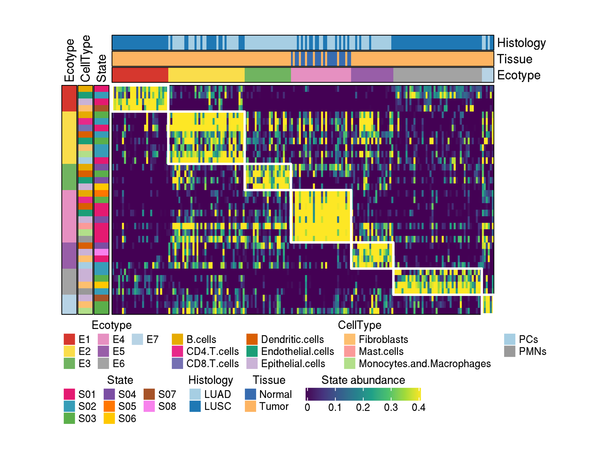
```


## **Tutorial 5.** *De novo* Discovery of Cell States and Ecotypes in scRNA-seq Data

In this tutorial we illustrate how one can perform *de novo*
identification of cell states and ecotypes, starting from a
**scRNA-seq** expression matrix. For illustration purposes, we use as
discovery dataset a downsampled version of the scRNA-seq from colorectal
cancer, available in `example_data/scRNA_CRC_data.txt`, together with
the sample annotation file `example_data/scRNA_CRC_annotation.txt`.

### 5.1. Overview of the EcoTyper workflow for discovering cell states in scRNA-seq data

EcoTyper derives cell states and ecotypes from scRNA-seq data in a
sequence of steps:

1.  **Extract cell type specific genes**: The removal of genes that are
    not specifically expressed in a given cell type, is an important
    consideration for reducing the likelihood of identifying spurious
    cell states. Ecotyper applies by default a filter for non-cell type
    specific genes, before performing cell state discovery in scRNA-seq
    data. Specifically, it performs a differential expression between
    cells from a given cell type and all other cell types combined. For
    computational efficency and balanced representation of cell types,
    only up to 500 randomly selected cells per cell type are used for
    this step. Genes with a Q-value > 0.05 (two-sided Wilcox test, with
    Benjamini-Hochberg correction for multiple hypothesis correction)
    are filtered out from each cell type. Of note, this filter is not
    necessary when discovering cell states in cell type specific
    profiles purified using CIBERSORTx high resolution ([Tutorial
    4](#tutorial-4-de-novo-discovery-of-cell-states-and-ecotypes-in-bulk-data)).
    CIBERSORTx incorporates its own filter for genes without evidence of
    expression in a given cell type.

2.  **Cell state discovery on correlation matrices**: EcoTyper leverages
    nonnegative matrix factorization (NMF) to identify
    transcriptionally-defined cell states from single cell expression
    profiles. However, NMF applied directly on scRNA-seq expression
    matrices may perform sub-optimally, since scRNA-seq data is
    generally sparse. Therefore, EcoTyper first applies NMF on the
    correlation matrix between each pair of cells from a given cell
    type. For computational efficency, EcoTyper only uses up to 2,500
    randomly selected cells for this step. <br/> To satisfy the
    non-negativity requirement of NMF, correlation matrices are
    individually processed using *posneg* transformation. This function
    converts a correlation matrix
     into
    two matrices, one containing only positive values and the other
    containing only negative values with the sign inverted. These two
    matrices are subsequently concatenated to produce
    .
    <br/> For each cell type, EcoTyper applies NMF across a range of
    ranks (number of cell states), by default 2-20 states. For each
    rank, the NMF algorithm is applied multiple times (we recommend at
    least 50) with different starting seeds, for robustness.

3.  **Choosing the number of cell states**: Cluster (state) number
    selection is an important consideration in NMF applications. We
    found that previous approaches that rely on minimizing error
    measures (e.g., RMSE, KL divergence) or optimizing
    information-theoretic metrics either failed to converge or were
    dependent on the number of genes imputed. In contrast, the
    cophenetic coefficient quantifies the classification stability for a
    given rank (i.e., the number of clusters) and ranges from 0 to 1,
    with 1 being maximally stable. While the rank at which the
    cophenetic coefficient starts decreasing is typically selected, this
    approach is challenging to apply in situations where the cophenetic
    coefficient exhibits a multi-modal shape across ranks, as we found
    for some cell types. Therefore, we developed a heuristic approach
    more suitable for such settings. In each case, the rank was
    automatically chosen based on the cophenetic coefficient evaluated
    in the range 2–20 clusters (by default). Specifically, we determined
    the first occurrence in the interval 2–20 for which the cophenetic
    coefficient dropped below 0.95 (by default), having been above this
    level for at least two consecutive ranks. We then selected the rank
    immediately adjacent to this crossing point which was closest to
    0.95 (by default).

4.  **Extracting cell state information**: The NMF output resulting from
    step 2 is parsed and cell state information is extracted for the
    downstream analyses.

5.  **Cell state re-discovery on expression matrices**: Following the
    identification of cell states on correlation matrices, EcoTyper
    performs differential expression to identify genes most highly
    associated with each cell state. The resulting markers are ranked by
    the fold-change in each state, and the top 1000 genes with the
    highest rank across cell states are selected for a new round of NMF.
    If less than 1000 genes are available, all genes are selected. Prior
    to NMF, each gene is scaled to mean 0 and unit variance. To satisfy
    the non-negativity requirement of NMF, cell type-specific expression
    matrices are individually processed using *posneg* transformation.
    This function converts an input expression matrix
     into
    two matrices, one containing only positive values and the other
    containing only negative values with the sign inverted. These two
    matrices are subsequently concatenated to produce
    .
    <br/> For each cell type, EcoTyper only applies NMF for the rank
    selected in step 3. As before, the NMF algorithm is applied multiple
    times (we recommend at least 50) with different starting seeds, for
    robustness.

6.  **Extracting cell state information**: The NMF output resulting from
    step 5 is parsed and cell state information is extracted for the
    downstream analyses.

7.  **Cell state QC filter**: Although posneg transformation is required
    to satisfy the non-negativity constraint of NMF following
    standardization, it can lead to the identification of spurious cell
    states driven by features with more negative values than positive
    ones. To combat this, we devised an adaptive false positive index
    (AFI), a novel index defined as the ratio between the sum of weights
    from the W matrix corresponding to the negative and positive
    features. EcoTyper automatically filters the states with
    .

8.  **Ecotype (cellular community) discovery**: *Ecotypes* or *cellular
    communities* are derived by identifying patterns of co-occurrence of
    cell states across samples. First, EcoTyper leverages the Jaccard
    index to quantify the degree of overlap between each pair of cell
    states across samples in the discovery cohort. Toward this end, it
    discretizes each cell state
     into a
    binary vector
     of length
    , where
     = the
    number of samples in the discovery cohort. Collectively, these
    vectors comprise binary matrix
    , with same
    number of rows as cell states across cell types and
     columns
    (samples). Given sample
    , if state
     is the
    most abundant state among all states in cell type
    , EcoTyper
    sets
    ")
    to 1; otherwise
     ← 0").
    It then computes all pairwise Jaccard indices on the rows (states)
    in matrix ,
    yielding matrix
    . Using the
    hypergeometric test, it evaluates the null hypothesis that any given
    pair of cell states
     and
     have no
    overlap. In cases where the hypergeometric p-value is >0.01, the
    Jaccard index for
    ")
    is set to 0 (i.e., no overlap). To identify communities while
    accommodating outliers, the updated Jaccard matrix
    
    is hierarchically clustered using average linkage with Euclidean
    distance (hclust in the R stats package). The optimal number of
    clusters is then determined via silhouette width maximization.
    Clusters with less than 3 cell states are eliminated from further
    analysis.

### 5.2. Checklist before performing cell states and ecotypes discovery in scRNA-seq data

In order for EcoTyper to perform cell states and ecotypes discovery, the
following resources need to be available:

-   a user-provided scRNA-seq expression matrix, on which the discovery
    will be performed (a discovery cohort). For this tutorial, we will
    use the example data in `example_data/scRNA_CRC_data.txt`.

-   a sample annotation file, such as the one provided in
    `example_data/scRNA_CRC_annotation.txt`, with at least three
    columns: ID, CellType and Sample.

### 5.3. Cell states and ecotypes discovery in scRNA-seq data

The script that does cell type and ecotype discovery is:

``` bash
Rscript EcoTyper_discovery_scRNA.R -h
```

    ## usage: EcoTyper_discovery_scRNA.R [-c <PATH>] [-h]
    ## 
    ## Arguments:
    ##   -c <PATH>, --config <PATH>
    ##                         Path to the config files [required].
    ##   -h, --help            Print help message.

This script takes as input file a configuration file in
[YAML](https://yaml.org/) format. The configuration file for this
tutorial is available in `config_discovery_scRNA.yml`:

``` yaml
default :
  Input :    
    Discovery dataset name : "discovery_scRNA_CRC"
    Expression matrix : "example_data/scRNA_CRC_data.txt"    
    Annotation file : "example_data/scRNA_CRC_annotation.txt" 
    Annotation file column to scale by : NULL
    Annotation file column(s) to plot : []
    
  Output :
    Output folder : "DiscoveryOutput_scRNA"

  Pipeline settings :
    #Pipeline steps:
    #   step 1 (extract cell type specific genes)
    #   step 2 (cell state discovery on correrlation matrices)
    #   step 3 (choosing the number of cell states)
    #   step 4 (extracting cell state information)
    #   step 5 (cell state re-discovery in expression matrices)
    #   step 6 (extracting information for re-discovered cell states)
    #   step 7 (cell state QC filter)
    #   step 8 (ecotype discovery)
    Pipeline steps to skip : [] 
    Filter non cell type specific genes : True
    Number of threads : 10
    Number of NMF restarts : 5
    Maximum number of states per cell type : 20
    Cophenetic coefficient cutoff : 0.95
    #The p-value cutoff used for filtering non-significant overlaps in the jaccard matrix used for discovering ecotypes in step 8. Default: 1 (no filtering).
    Jaccard matrix p-value cutoff : 1
```

The configuration file has three sections, *Input*, *Output* and
*Pipeline settings*. We next will describe the expected content in each
of these three sections, and instruct the user how to set the
appropriate settings in their applications.

#### Input section

The *Input* section contains settings regarding the input data.

#### Discovery dataset name

*Discovery dataset name* is the identifier used by EcoTyper to
internally save and retrieve the information about the cell
states/ecotypes defined on this discovery dataset. It is also the name
to be provided to the *-d*/*–discovery* argument of scripts
`EcoTyper_recovery_scRNA.R` and `EcoTyper_recovery_bulk.R`, when
performing cell state/ecotypes recovery. Any value that contains
alphanumeric characters and ’\_’ is accepted for this field.

``` yaml
Discovery dataset name : "discovery_scRNA_CRC"
```

#### Expression matrix

``` yaml
Expression matrix : "example_data/scRNA_CRC_data.txt"
```

*Expression matrix* field should contain the path to a tab-delimited
file containing the expression data, with genes as rows and cells as
columns. The expression matrix should be in the TPM, CPM or other
suitable normalized space. The users should perform their own quality
control of the expression matrix before applying EcoTyper (e.g. to
filter low-quality cells, doublets, etc.). However we do not recommend
to pre-filter the matrix for variable genes, as EcoTyper performs an
internal selection for genes that show cell-type specificity. The matrix
should have gene symbols on the first column and gene counts for each
cell on the next columns. Column (cells) names should be unique. Also,
we recommend that the column names do not contain special characters
that are modified by the R function *make.names*, *e.g.* having digits
at the beginning of the name or containing characters such as *space*,
*tab* or *-*:

The expected format for the expression matrix is:

``` r
data = read.delim("example_data/scRNA_CRC_data.txt", nrow = 5)
dim(data)
```

    ## [1]     5 13781

``` r
head(data[,1:5])
```

    ##      Gene SMC01.T_AAAGATGCATGGATGG SMC01.T_AAAGTAGCAAGGACAC
    ## 1    A1BG                        0                        0
    ## 2    A1CF                        0                        0
    ## 3     A2M                        0                        0
    ## 4   A2ML1                        0                        0
    ## 5 A3GALT2                        0                        0
    ##   SMC01.T_AAATGCCAGGATCGCA SMC01.T_AACTCTTCACAACGCC
    ## 1                        0                        0
    ## 2                        0                        0
    ## 3                        0                        0
    ## 4                        0                        0
    ## 5                        0                        0

#### Annotation file

``` yaml
Annotation file : "example_data/scRNA_CRC_annotation.txt"
```

A path to an annotation file should be provided in the field *Annotation
file*. This file should contain a column called **ID** with the same
names (e.g. cell barcodes) as the columns of the expression matrix, a
column called **CellType** indicating cell type for each cell, and a
column called **Sample** indicating the sample identifier for each cell.
The latter is used for ecotype discovery. This file can contain any
number of additional columns. The additional columns can be used for
defining sample batches (see Section *Annotation file column to scale
by* below) and for plotting color bars in the heatmaps output (see
Section *Annotation file column(s) to plot* below). For the current
example, the annotation file has the following format:

``` r
annotation = read.delim("example_data/scRNA_CRC_annotation.txt", nrow = 5)
dim(annotation)
```

    ## [1] 5 9

``` r
head(annotation)
```

    ##                      Index Patient Class  Sample        Cell_type Cell_subtype
    ## 1 SMC01-T_AAAGATGCATGGATGG   SMC01 Tumor SMC01-T Epithelial cells         CMS2
    ## 2 SMC01-T_AAAGTAGCAAGGACAC   SMC01 Tumor SMC01-T Epithelial cells         CMS2
    ## 3 SMC01-T_AAATGCCAGGATCGCA   SMC01 Tumor SMC01-T Epithelial cells         CMS2
    ## 4 SMC01-T_AACTCTTCACAACGCC   SMC01 Tumor SMC01-T Epithelial cells         CMS2
    ## 5 SMC01-T_AACTTTCGTTCGGGCT   SMC01 Tumor SMC01-T Epithelial cells         CMS2
    ##           CellType                       ID Tissue
    ## 1 Epithelial.cells SMC01.T_AAAGATGCATGGATGG  Tumor
    ## 2 Epithelial.cells SMC01.T_AAAGTAGCAAGGACAC  Tumor
    ## 3 Epithelial.cells SMC01.T_AAATGCCAGGATCGCA  Tumor
    ## 4 Epithelial.cells SMC01.T_AACTCTTCACAACGCC  Tumor
    ## 5 Epithelial.cells SMC01.T_AACTTTCGTTCGGGCT  Tumor

#### Annotation file column to scale by

``` yaml
Annotation file column to scale by : NULL
```

In order to discover pan-carcinoma cell states and ecotypes in the
EcoType carcinoma paper, we standardize genes to mean 0 and unit
variance *within* each tumor type (histology). Field *Annotation file
column to scale by* allows users to specify a column name in the
annotation file, by which the cells will be grouped when performing
standardization. However, this is an analytical choice, depending on the
purpose of the analysis. If the users are interested in defining cell
states and ecotypes regardless of tumor type-specificity, this argument
can be set to **NULL**. In this case, the standardization will be
applied across all samples in the discovery cohort. The same will happen
if the annotation file is not provided.

In the current example, this field is not used and therefore set to
NULL.

#### Annotation file column(s) to plot

``` yaml
Annotation file column(s) to plot : ["Histology", "Tissue"]
```

*Annotation file column(s) to plot* field specifies which columns in the
annotation file will be used as color bar in the output heatmaps, in
addition to the cell state label column, plotted by default.

#### The output section

The *Output* section contains a single field, *Output folder*, which
specifies the path where the final output will be saved. This folder
will be created if it does not exist.

``` yaml
Output folder : "DiscoveryOutput_scRNA"
```

#### Pipeline settings

The last section, *Pipeline settings*, contains settings controlling how
EcoTyper is run.

#### Pipeline steps to skip

``` yaml
 #Pipeline steps:
    #   step 1 (extract cell type specific genes)
    #   step 2 (cell state discovery on correlation matrices)
    #   step 3 (choosing the number of cell states)
    #   step 4 (extracting cell state information)
    #   step 5 (cell state re-discovery in expression matrices)
    #   step 6 (extracting information for re-discovered cell states)
    #   step 7 (cell state QC filter)
    #   step 8 (ecotype discovery)
```

The *Pipeline steps to skip* option allows user to skip some of the
steps outlined in section *Overview of the EcoTyper workflow for
discovering cell states*. Please note that this option is only intended
for cases when the pipeline had already been run once, and small
adjustments are made to the parameters. For example, if the Cophenetic
coefficient cutoff used in step 3 needs adjusting, the user might want
to skip steps 1-2 and re-run from step 3 onwards.

#### Filter non cell type specific genes

``` yaml
Filter non cell type specific genes : True
```

Flag indicated whether to apply the filter for cell type specific genes
in step 1, outlined in section *Overview of the EcoTyper workflow for
discovering cell states*. For best results, we do recommend applying
this filter.

#### Number of threads

``` yaml
Number of threads : 10
```

The number of threads EcoTyper will be run on.

#### Number of NMF restarts

``` yaml
Number of NMF restarts : 5
```

The NMF approach used by EcoTyper (Brunet et al.), can give slightly
different results, depending on the random initialization of the
algorithm. To obtain a stable solution, NMF is generally run multiple
times with different seeds, and the solution that best explains the
discovery data is chosen. Additionally, the variation of NMF solutions
across restarts with different seeds is quantified using Cophenetic
coefficients and used in step 4 of EcoTyper for selecting the number of
states. The parameter *Number of NMF restarts* specifies how many
restarts with different seed should EcoTyper perform for each rank
selection, in each cell type. Since this is a very time consuming
process, in this example we only use 5. **However, for
publication-quality results, we recommend at least 50 restarts**.

#### Maximum number of states per cell type

``` yaml
Maximum number of states per cell type : 20
```

**Maximum number of states per cell type** specifies the upper end of
the range for the number of states possible for each cell type. The
lower end is 2.

#### Cophenetic coefficient cutoff

``` yaml
Cophenetic coefficient cutoff : 0.975
```

This field indicates the Cophenetic coefficient cutoff, in the range
\[0, 1\], used for automatically determining the number of states in
step 4. Lower values generally lead to more clusters being identified.
In this particular example, we set it to 0.975.

#### Jaccard matrix p-value cutoff

``` yaml
Jaccard matrix p-value cutoff : 1
```

Ecotype identification on step 8 is performed by clustering a jaccard
matrix that quantifies the sample overlap between each pair of states.
Prior to performing ecotype identification, the jaccard matrix values
corresponding to pairs of states for which the sample overlap is not
significant are set to 0, in order to mitigate the noise introduced by
spurious overlaps. The value provided in this field specifies the
p-value cutoff above which the overlaps are considered non-significant.
When the number of samples in the scRNA-seq dataset is small, such as in
the current example, we recommend this filter is disabled (p-value
cutoff = 1), to avoid over-filtering the jaccard matrix. However, we
encourage users to set this cutoff to lower values (e.g. 0.05), if the
discovery scRNA-seq dataset contains a number of samples large enough to
reliably evaluate the significance of overlaps.

### 5.4. The command line

After editing the configuration file (`config_discovery_scRNA.yml`), the
*de novo* discovery cell states and ecotypes can be run as is
illustrated below. Please note that this script might take 24-48 hours
to run on 10 threads. Also, EcoTyper cannot be run on the example data
from this tutorial using a typical laptop (16GB memory). We recommend
that it is run on a server with \>50-100GB of RAM or a high performance
cluster.

``` r
Rscript EcoTyper_discovery_scRNA.R -c config_discovery_scRNA.yml
```

### 5.5. The output format

EcoTyper generates for each cell type the following outputs:

-   Plots displaying the Cophenetic coefficient calculated in step 4.
    The horizontal dotted line indicates the Cophenetic coefficient
    cutoff provided in the configuration file *Cophenetic coefficient
    cutoff* field. The vertical dotted red line indicates the number of
    states automatically selected based on the Cophenetic coefficient
    cutoff provided. We recommend that users inspect this file to make
    sure that the automatic selection provides sensible results. If the
    user wants to adjust the Cophenetic coefficient cutoff after
    inspecting this plot, they can rerun the discovery procedure
    skipping steps 1-3. **Please note that:**

    1.  **These plots indicate the number of states obtained before
        applying the filters for low-quality states in steps 6 and 7.
        Therefore, the final results will probably contain fewer
        states**.
    2.  **The plots below might look slightly different when generated
        with R versions other than R/3.6.0. This is because some
        EcoTyper steps, including NMF algorithm initialization, depend
        on random number generation. Althoguh EcoTyper sets random seeds
        before each such step, different R version output different
        random numbers for the same seed. To mitigate this issue, we
        recommend at least 50 NMF restarts when running EcoTyper**.

``` r
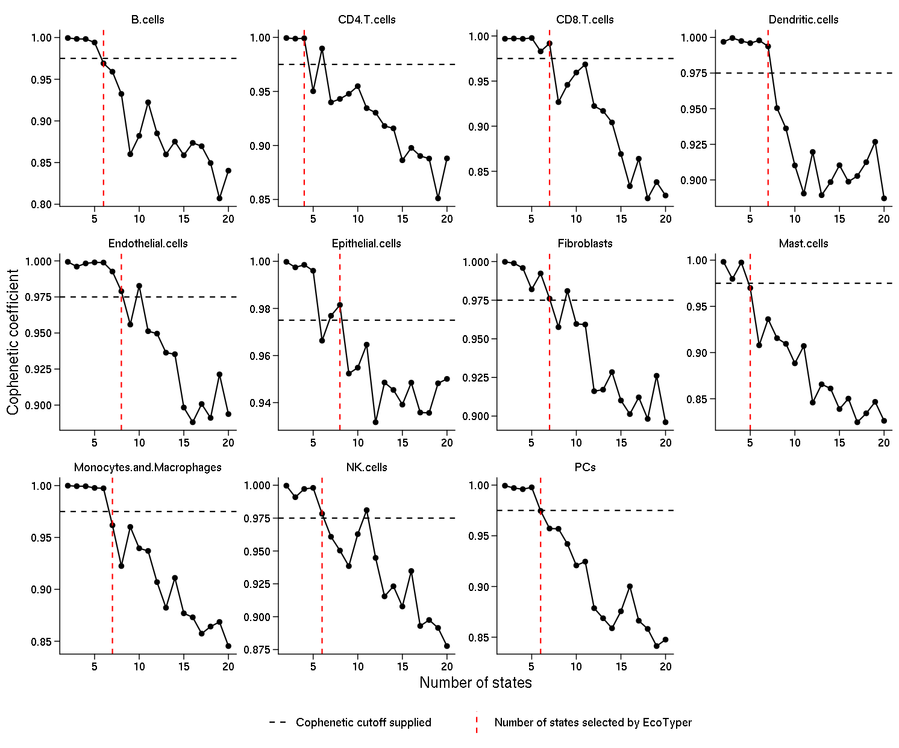
```


-   For each cell type, the following outputs, exemplified here for
    fibroblasts, are produced:

    -   Abundances of cell states remaining after the QC filters in
        steps 6 and 7 (if run), across samples in the discovery dataset:

``` r
data = read.delim("DiscoveryOutput_scRNA/Fibroblasts/state_abundances.txt")
dim(data)
```

    ## [1]    5 1500

``` r
head(data[,1:5])
```

    ##     SMC01.T_AAAGTAGAGTGGTAGC SMC01.T_ACACCCTGTTGGTAAA SMC01.T_ACATCAGTCGCCTGAG
    ## S01             2.074345e-14             4.262766e-02             1.352784e-14
    ## S02             2.074345e-14             3.332167e-01             3.957569e-01
    ## S03             2.781436e-02             1.204917e-02             1.706085e-01
    ## S04             2.074345e-14             9.441681e-13             1.352784e-14
    ## S05             2.074345e-14             6.121064e-01             7.391235e-02
    ##     SMC01.T_ACTATCTAGCTAGTCT SMC01.T_ACTGATGAGCACCGCT
    ## S01             5.529717e-02             1.022447e-14
    ## S02             2.081811e-14             1.805516e-01
    ## S03             3.519208e-02             6.787254e-01
    ## S04             2.081811e-14             1.022447e-14
    ## S05             2.081811e-14             7.112757e-02

-   Assignment of samples in the discovery dataset to the cell state
    with the highest abundance. Only samples assigned to the cell states
    remaining after the QC filters in steps 6 and 7 (if run) are
    included. The remaining ones are considered unassigned and removed
    from this table:

``` r
data = read.delim("DiscoveryOutput_scRNA/Fibroblasts/state_assignment.txt")
dim(data)
```

    ## [1] 899   3

``` r
head(data)
```

    ##                           ID State InitialState
    ## 723 SMC15.T_CATCGAAGTGACCAAG   S01         IS05
    ## 724 SMC18.T_CTTGGCTCAGTGACAG   S01         IS05
    ## 725 SMC24.T_TACTTACAGCGCCTTG   S01         IS05
    ## 726 SMC01.N_CACCAGGCAATAAGCA   S01         IS05
    ## 727 SMC02.N_AGAGCTTTCTAACCGA   S01         IS05
    ## 728 SMC02.N_ATAACGCCAATACGCT   S01         IS05

-   A heatmap illustrating the expression of genes used for cell state
    discovery, that have the highest fold-change in one of the cell
    states remaining after the QC filters in steps 6 and 7 (if run). In
    the current example, the heatmap includes in the top color bar two
    rows corresponding to *Tissue* and *Histology*, that have been
    provided in configuration file field *Annotation file column(s) to
    plot*, in addition to cell state labels always plotted:

``` r
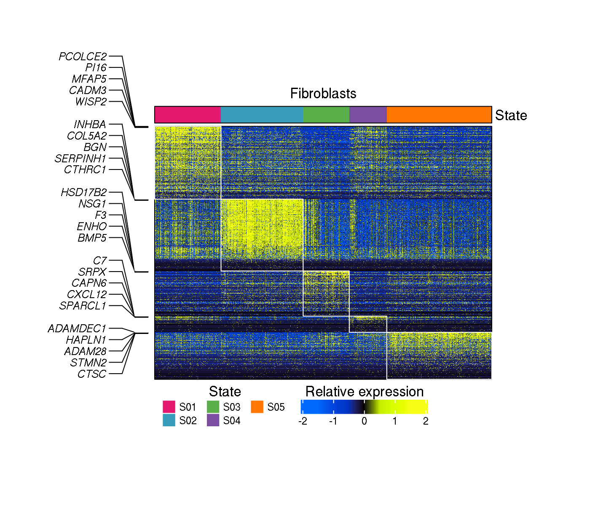
```


The ecotype output files include:

-   The cell state composition of each ecotype (the set of cell states
    making up each ecotype):

``` r
ecotypes = read.delim("DiscoveryOutput_scRNA/Ecotypes/ecotypes.txt")
head(ecotypes[,c("CellType", "State", "Ecotype")])
```

    ##                    CellType State Ecotype
    ## 1                   B.cells   S02      E1
    ## 2               CD4.T.cells   S02      E1
    ## 3               CD8.T.cells   S01      E1
    ## 4           Dendritic.cells   S03      E1
    ## 5               Fibroblasts   S05      E1
    ## 6 Monocytes.and.Macrophages   S03      E1

-   The number of initial clusters obtained by clustering the Jaccard
    index matrix, selected using the average silhouette:

``` r
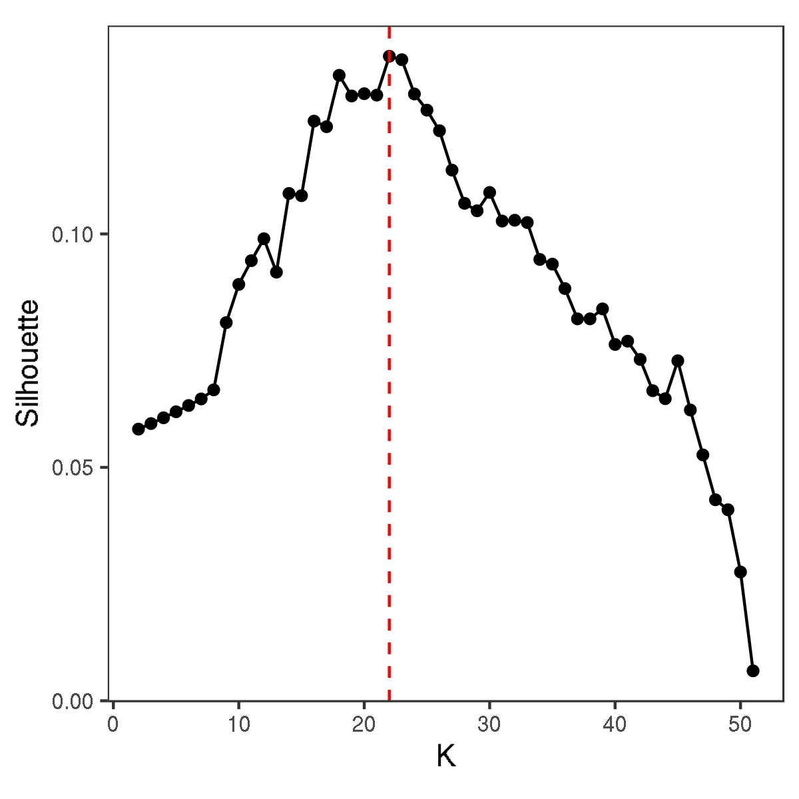
```


-   A heatmap of the Jaccard index matrix, after filtering ecotypes with
    less than 3 cell states:

``` r
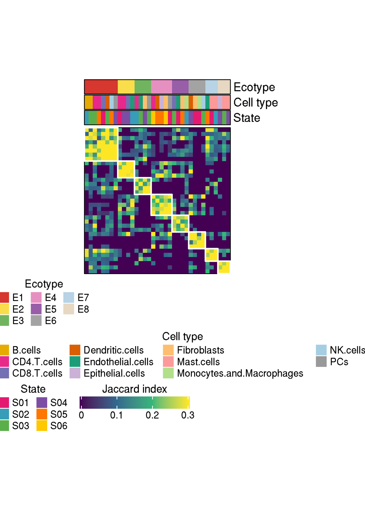
```


-   The abundance of each ecotype in each sample in the discovery
    dataset:

``` r
abundances = read.delim("DiscoveryOutput_scRNA/Ecotypes/ecotype_abundance.txt")
dim(abundances)
```

    ## [1]  9 33

``` r
head(abundances[,1:5])
```

    ##       SMC01.N    SMC01.T    SMC02.N    SMC02.T    SMC03.N
    ## E1 0.34064095 0.07302366 0.20329837 0.02049678 0.27718758
    ## E2 0.06078240 0.17093342 0.02937202 0.10322721 0.05241208
    ## E3 0.02315383 0.34562878 0.01355632 0.36202739 0.01278497
    ## E4 0.13787420 0.12543986 0.14604672 0.16681631 0.06725426
    ## E5 0.16081886 0.10434607 0.28980392 0.11903111 0.14459666
    ## E6 0.00000000 0.07347385 0.03524642 0.14282270 0.00000000

-   The assignment of samples in the discovery dataset to ecotypes. The
    samples not assigned to any ecotype are filtered out from this file:

``` r
assignments = read.delim("DiscoveryOutput_scRNA/Ecotypes/ecotype_assignment.txt")
dim(assignments)
```

    ## [1] 32  6

``` r
head(assignments[,1:5])
```

    ##              ID MaxEcotype  AssignmentP  AssignmentQ AssignedToEcotypeStates
    ## SMC01-N SMC01-N         E1 1.938649e-04 0.0012795085                    TRUE
    ## SMC05-N SMC05-N         E1 5.000404e-03 0.0183348142                    TRUE
    ## SMC05-T SMC05-T         E1 7.568441e-02 0.1541417608                    TRUE
    ## SMC07-N SMC07-N         E1 2.928585e-03 0.0138061877                    TRUE
    ## SMC08-N SMC08-N         E1 9.015769e-05 0.0007438009                    TRUE
    ## SMC19-T SMC19-T         E1 5.936002e-03 0.0195888071                    TRUE

-   A heatmap of cell state fractions across the samples assigned to
    ecotypes:

``` r
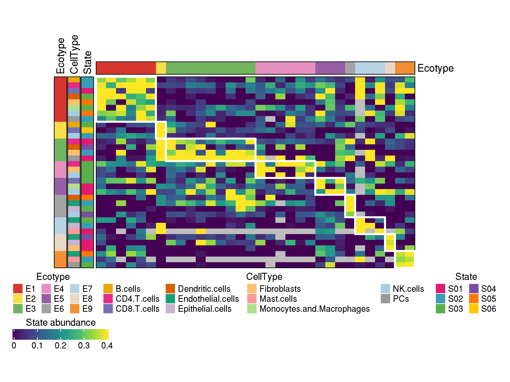
```


## **Tutorial 6.** *De novo* Discovery of Cell States and Ecotypes in Pre-Sorted Data

In this tutorial we illustrate how one can perform *de novo*
identification of cell states and ecotypes, starting from cell-type
specific expression matrices, obtained either through FACS-sorting cell
populations of interest and then peforming bulk tissue expression
profiling of each cell population, or by performing *in silico*
purification, using CIBERSORTx or any other tool. For illustration
purposes, we use the cell type specific profiles inferred by CIBERSORTx
in [Tutorial
4](#tutorial-4-de-novo-discovery-of-cell-states-and-ecotypes-in-bulk-data),
based on a downsampled version of the TCGA samples from lung
adenocarcinoma (LUAD) and lung squamous cell carcinoma (LUSC).

### 6.1. Overview of the EcoTyper workflow for discovering cell states in pre-sorted data

EcoTyper derives cell states and ecotypes in a sequence of steps:

1.  **Extract cell type specific genes**: The removal of genes that are
    not specifically expressed in a given cell type, is an important
    consideration for reducing the likelihood of identifying spurious
    cell states. Ecotyper applies by default a filter for non-cell type
    specific genes, before performing cell state discovery in pre-sorted
    data. Specifically, it performs a differential expression between
    cells from a given cell type and all other cell types combined. For
    computational efficency and balanced representation of cell types,
    only up to 500 randomly selected samples per cell type are used for
    this step. Genes with a Q-value > 0.05 (two-sided Wilcox test, with
    Benjamini-Hochberg correction for multiple hypothesis correction)
    are filtered out from each cell type. Of note, this filter is not
    necessary when discovering cell states in cell type specific
    profiles purified using CIBERSORTx high resolution (e.g. [Tutorial
    4](#tutorial-4-de-novo-discovery-of-cell-states-and-ecotypes-in-bulk-data)),
    as CIBERSORTx incorporates its own filter for genes without evidence
    of expression in a given cell type. We do recommend applying it if
    cell type specific profiles were obtained through FACS-sorting or
    other deconvolution tool that does not filter for cell type specific
    genes.

2.  **Cell state discovery**: EcoTyper leverages nonnegative matrix
    factorization (NMF) to identify transcriptionally-defined cell
    states from cell type specific expression profiles (step 1). Given c
    cell types, let
     be a
    
    cell type-specific expression matrix for cell type
     consisting
    of  rows
    (the number of genes) and
     columns
    (the number of samples). The primary objective of NMF is to
    factorize
     into
    two non-negative matrices: a
    
    matrix, ,
    and a
    
    matrix, ,
    where  is a
    user-specified rank (i.e., number of clusters). The basis matrix,
    , encodes a
    representative expression level for each gene in each cell state.
    The mixture coefficients matrix
    , scaled to
    sum to 1 across cell states, encodes the representation (relative
    abundance) of each cell state in each sample. <br/> EcoTyper applies
    NMF on the top 1000 genes with highest relative dispersion across
    samples. If less than 1000 genes are available, all genes are
    selected. If less than 50 genes are imputed for a given cell type,
    that cell type is not used for cell state identification. Prior to
    NMF, each gene is scaled to mean 0 and unit variance. To satisfy the
    non-negativity requirement of NMF, cell type-specific expression
    matrices are individually processed using *posneg* transformation.
    This function converts an input expression matrix
     into
    two matrices, one containing only positive values and the other
    containing only negative values with the sign inverted. These two
    matrices are subsequently concatenated to produce
    .
    <br/> For each cell type, EcoTyper applies NMF across a range of
    ranks (number of cell states), by default 2-20 states. For each
    rank, the NMF algorithm is applied multiple times (we recommend at
    least 50) with different starting seeds, for robustness.

3.  **Choosing the number of cell states**: Cluster (state) number
    selection is an important consideration in NMF applications. We
    found that previous approaches that rely on minimizing error
    measures (e.g., RMSE, KL divergence) or optimizing
    information-theoretic metrics either failed to converge or were
    dependent on the number of genes imputed. In contrast, the
    cophenetic coefficient quantifies the classification stability for a
    given rank (i.e., the number of clusters) and ranges from 0 to 1,
    with 1 being maximally stable. While the rank at which the
    cophenetic coefficient starts decreasing is typically selected, this
    approach is challenging to apply in situations where the cophenetic
    coefficient exhibits a multi-modal shape across ranks, as we found
    for some cell types. Therefore, we developed a heuristic approach
    more suitable for such settings. In each case, the rank was
    automatically chosen based on the cophenetic coefficient evaluated
    in the range 2–20 clusters (by default). Specifically, we determined
    the first occurrence in the interval 2–20 for which the cophenetic
    coefficient dropped below 0.95 (by default), having been above this
    level for at least two consecutive ranks. We then selected the rank
    immediately adjacent to this crossing point which was closest to
    0.95 (by default).

4.  **Extracting cell state information**: The NMF output resulting from
    step 2 is parsed and cell state information is extracted for the
    downstream analyses.

5.  **Cell state QC filter**: Although posneg transformation is required
    to satisfy the non-negativity constraint of NMF following
    standardization, it can lead to the identification of spurious cell
    states driven by features with more negative values than positive
    ones. To combat this, we devised an adaptive false positive index
    (AFI), a novel index defined as the ratio between the sum of weights
    from the W matrix corresponding to the negative and positive
    features. EcoTyper automatically filters the states with
    .

6.  **Advanced cell state QC filter**: When the discovery dataset is
    comprised of multiple tumor types, we recommend using this advanced
    filter. This filter identifies poor-quality cell states using a
    dropout score, which flags states whose marker genes exhibit
    anomalously low variance and high expression across the discovery
    cohort, generally an artefact of CIBEROSRTx HiRes. To calculate the
    dropout score for each marker gene (i.e., genes with maximal log2
    fold change in each state relative to other states within a given
    cell type), EcoTyper determines the maximum fraction of samples for
    which the gene has the same value. It also calculates the average
    log2 expression of the gene across samples. It averages each
    quantity, scaled to unit variance across states, within each state,
    converts them to z-scores, and removes states with a mean Z >1.96 (P
    \< 0.05).

7.  **Ecotype (cellular community) discovery**: *Ecotypes* or *cellular
    communities* are derived by identifying patterns of co-occurrence of
    cell states across samples. First, EcoTyper leverages the Jaccard
    index to quantify the degree of overlap between each pair of cell
    states across samples in the discovery cohort. Toward this end, it
    discretizes each cell state
     into a
    binary vector
     of length
    , where
     = the
    number of samples in the discovery cohort. Collectively, these
    vectors comprise binary matrix
    , with same
    number of rows as cell states across cell types and
     columns
    (samples). Given sample
    , if state
     is the
    most abundant state among all states in cell type
    , EcoTyper
    sets
    ")
    to 1; otherwise
     ← 0").
    It then computes all pairwise Jaccard indices on the rows (states)
    in matrix ,
    yielding matrix
    . Using the
    hypergeometric test, it evaluates the null hypothesis that any given
    pair of cell states
     and
     have no
    overlap. In cases where the hypergeometric p-value is >0.01, the
    Jaccard index for
    ")
    is set to 0 (i.e., no overlap). To identify communities while
    accommodating outliers, the updated Jaccard matrix
    
    is hierarchically clustered using average linkage with Euclidean
    distance (hclust in the R stats package). The optimal number of
    clusters is then determined via silhouette width maximization.
    Clusters with less than 3 cell states are eliminated from further
    analysis.

### 6.2. Checklist before performing cell states and ecotypes discovery

In order for EcoTyper to perform cell states and ecotypes discovery, the
following resources need to be available:

-   user-provided cell-type specific expression matrices, on which the
    discovery will be performed (a discovery cohort). For this tutorial,
    we will use the example data in
    `example_data/Tutorial_6/PresortedDiscovery`.

-   optionally, a sample annotation file, such as the one provided in
    `example_data/Tutorial_6/PresortedDiscovery_annotation.txt`, can be
    supplied to EcoTyper. The information in this file can be used for
    heatmap plotting purposes, and also to instruct EcoTyper to find
    cell states/ecotypes common across different biological batches
    (e.g. tumor types), as detailed below.

### 6.3. Cell states and ecotypes discovery

The script that does cell type and ecotype discovery is:

``` bash
Rscript EcoTyper_discovery_presorted.R -h
```

    ## usage: EcoTyper_discovery_presorted.R [-c <PATH>] [-h]
    ## 
    ## Arguments:
    ##   -c <PATH>, --config <PATH>
    ##                         Path to the config files [required].
    ##   -h, --help            Print help message.

This script takes as input file a configuration file in
[YAML](https://yaml.org/) format. The configuration file for this
tutorial is available in `config_discovery_presorted.yml`:

``` yaml
  default :
  Input :    
    Discovery dataset name : "PresortedDiscovery"
    Expression matrices : "example_data/Tutorial_6/PresortedDiscovery"            
    Annotation file : "example_data/Tutorial_6/PresortedDiscovery_annotation.txt"
    Annotation file column to scale by : "Histology"
    Annotation file column(s) to plot : ["Histology", "Tissue"]
        
  Output :
    Output folder : "PresortedDiscoveryOutput"

  Pipeline settings :
    #Pipeline steps:
    #   step 1 (extract cell type specific genes)    
    #   step 2 (cell state discovery)
    #   step 3 (choosing the number of cell states)
    #   step 4 (extracting cell state information)
    #   step 5 (cell state QC filter)
    #   step 6 (advanced cell state QC filter)
    #   step 7 (ecotype discovery)
    Pipeline steps to skip : [6,] 
    Filter non cell type specific genes : False
    Number of threads : 10    
    Number of NMF restarts : 5
    Maximum number of states per cell type : 20
    Cophenetic coefficient cutoff : 0.95
    
```

The configuration file has three sections, *Input*, *Output* and
*Pipeline settings*. We next will describe the expected content in each
of these three sections, and instruct the user how to set the
appropriate settings in their applications.

#### Input section

The *Input* section contains settings regarding the input data.

#### Discovery dataset name

*Discovery dataset name* is the identifier used by EcoTyper to
internally save and retrieve the information about the cell
states/ecotypes defined on this discovery dataset. It is also the name
to be provided to the *-d*/*–discovery* argument of scripts
`EcoTyper_recovery_scRNA.R` and `EcoTyper_recovery_bulk.R`, when
performing cell state/ecotypes recovery. Any value that contains
alphanumeric characters and ’\_’ is accepted for this field.

``` yaml
Discovery dataset name : "PresortedDiscovery"
```

#### Expression matrix

``` yaml
Expression matrices : "example_data/Tutorial_6/PresortedDiscovery"
```

*Expression matrices* field should contain the path to directory with a
tab-delimited file containing cell type specific expression data for
each cell type. Each file should have genes as rows and samples as
columns, should be in the TPM or FPKM space for bulk RNA-seq and
**non-logarithmic** (exponential) space for microarrays. They should
have gene symbols on the first column and gene counts for each sample on
the next columns. Column (sample) names should be unique within each
file. The same sample ids (column names) should be present in each cell
type specific matrix. Also, we recommend that the column names do not
contain special characters that are modified by the R function
*make.names*, *e.g.* having digits at the beginning of the name or
containing characters such as *space*, *tab* or *-*:

The expected format for each expression matrix is:

``` r
data = read.delim("example_data/Tutorial_6/PresortedDiscovery/Fibroblasts.txt", nrow = 5)
dim(data)
```

    ## [1]   5 251

``` r
head(data[,1:5])
```

    ##   GeneSymbol TCGA.37.A5EN.01A.21R.A26W.07 TCGA.37.4133.01A.01R.1100.07
    ## 1       A1BG                    29.356911                    29.220771
    ## 2       AAR2                    47.746044                    47.746617
    ## 3      ABCA6                     5.803932                     5.413472
    ## 4      ABCB7                    23.299299                    25.486127
    ## 5       ABI2                    37.677476                    32.007233
    ##   TCGA.77.7465.01A.11R.2045.07 TCGA.34.5240.01A.01R.1443.07
    ## 1                    29.228389                    28.835613
    ## 2                    47.828573                    47.679150
    ## 3                     6.259786                     6.092511
    ## 4                    43.447296                    41.077193
    ## 5                    31.775814                    31.421975

#### Annotation file

``` yaml
Annotation file : "example_data/Tutorial_6/PresortedDiscovery_annotation.txt"
```

A path to an annotation file can be provided in the field *Annotation
file*. If provided, this file should contain a column called **ID** with
the same names as the columns of the expression matrices, and any number
of additional columns. The additional columns can be used for defining
sample batches (see Section *Annotation file column to scale by* below)
and for plotting color bars in the heatmaps output (see Section
*Annotation file column(s) to plot* below). If not provided, this field
needs to be set to **“NULL”**. For the current example, the annotation
file has the following format:

``` r
annotation = read.delim("example_data/Tutorial_6/PresortedDiscovery_annotation.txt", nrow = 5)
dim(annotation)
```

    ## [1] 5 6

``` r
head(annotation)
```

    ##                             ID Tissue Histology                Type OS_Time
    ## 1 TCGA.37.A5EN.01A.21R.A26W.07  Tumor      LUSC Primary Solid Tumor     660
    ## 2 TCGA.37.4133.01A.01R.1100.07  Tumor      LUSC Primary Solid Tumor     238
    ## 3 TCGA.77.7465.01A.11R.2045.07  Tumor      LUSC Primary Solid Tumor     990
    ## 4 TCGA.34.5240.01A.01R.1443.07  Tumor      LUSC Primary Solid Tumor    1541
    ## 5 TCGA.05.4249.01A.01R.1107.07  Tumor      LUAD Primary Solid Tumor    1523
    ##   OS_Status
    ## 1         0
    ## 2         0
    ## 3         0
    ## 4         0
    ## 5         0

#### Annotation file column to scale by

``` yaml
Annotation file column to scale by : "Histology"
```

In order to discover pan-carcinoma cell states and ecotypes in the
EcoType carcinoma paper, we standardize genes to mean 0 and unit 1
*within* each tumor type (histology). Field *Annotation file column to
scale by* allows users to specify a column name in the annotation file,
by which the samples will be grouped when performing standardization.
The example discovery dataset used in this tutorial has samples from
lung adenocarcinoma and lung squamous cell carcinoma. Therefore, for
this tutorial we will use the **Histology** column to perform
standardization.

However, this is an analytical choice, depending on the purpose of the
analysis. If the users are interested in defining cell states and
ecotypes regardless of tumor type-specificity, this argument can be set
to **“NULL”**. In this case, the standardization will be applied across
all samples in the discovery cohort. The same will happen if the
annotation file is not provided.

#### Annotation file column(s) to plot

``` yaml
Annotation file column(s) to plot : ["Histology", "Tissue"]
```

*Annotation file column(s) to plot* field specifies which columns in the
annotation file will be used as color bar in the output heatmaps, in
addition to the cell state label or ecotype label column, plotted by
default.

#### The output section

The *Output* section contains a single field, *Output folder*, which
specifies the path where the final output will be saved. This folder
will be created if it does not exist.

``` yaml
Output folder : "PresortedDiscoveryOutput"
```

#### Pipeline settings

The last section, *Pipeline settings*, contains settings controlling how
EcoTyper is run.

#### Pipeline steps to skip

``` yaml
    Pipeline steps:
    #   step 1 (extract cell type specific genes)    
    #   step 2 (cell state discovery)
    #   step 3 (choosing the number of cell states)
    #   step 4 (extracting cell state information)
    #   step 5 (cell state QC filter)
    #   step 6 (advanced cell state QC filter)
    #   step 7 (ecotype discovery)
    Pipeline steps to skip : [6,] #by default, step 6 is skipped
```

The *Pipeline steps to skip* option allows user to skip some of the
steps outlined in section *Overview of the EcoTyper workflow for
discovering cell states*. Please note that this option is only intended
for cases when the pipeline had already been run once, and small
adjustments are made to the parameters. For example, if the Cophenetic
coefficient cutoff used in step 3 needs adjusting, the user might want
to skip steps 1-2 and re-run from step 3 onwards.

#### Filter non cell type specific genes

``` yaml
Filter non cell type specific genes : False
```

Flag indicated whether to apply the filter for cell type specific genes
in step 1, outlined in section *Overview of the EcoTyper workflow for
discovering cell states*. This filter is not necessary when discovering
cell states in cell type specific profiles purified using CIBERSORTx
high resolution (e.g. [Tutorial
4](#tutorial-4-de-novo-discovery-of-cell-states-and-ecotypes-in-bulk-data)),
as CIBERSORTx incorporates its own filter for genes without evidence of
expression in a given cell type. We do recommend applying it if cell
type specific profiles were obtained through FACS-sorting or other
deconvolution tool that does not filter for cell type specific genes.

We set it to False in this tutorial, as the input matrices were obtained
using CIBERSORTx.

#### Number of threads

``` yaml
Number of threads : 10
```

The number of threads EcoTyper will be run on.

#### Number of NMF restarts

``` yaml
Number of NMF restarts : 5
```

The NMF approach used by EcoTyper (Brunet et al.), can give slightly
different results, depending on the random initialization of the
algorithm. To obtain a stable solution, NMF is generally run multiple
times with different seeds, and the solution that best explains the
discovery data is chosen. Additionally, the variation of NMF solutions
across restarts with different seeds is quantified using Cophenetic
coefficients and used in step 4 of EcoTyper for selecting the number of
states. The parameter *Number of NMF restarts* specifies how many
restarts with different seed should EcoTyper perform for each rank
selection, in each cell type. Since this is a very time consuming
process, in this example we only use 5. **However, for
publication-quality results, we recommend at least 50 restarts**.

#### Maximum number of states per cell type

``` yaml
Maximum number of states per cell type : 20
```

**Maximum number of states per cell type** specifies the upper end of
the range for the number of states possible for each cell type. The
lower end is 2.

#### Cophenetic coefficient cutoff

``` yaml
Cophenetic coefficient cutoff : 0.95
```

This field indicates the Cophenetic coefficient cutoff, in the range
\[0, 1\], used for automatically determining the number of states in
step 4. Lower values generally lead to more clusters being identified.

### 6.4. The command line

After editing the configuration file (`config_discovery_presorted.yml`),
the *de novo* discovery cell states and ecotypes from presorted
expression profiles can be run as is illustrated below. Please note that
this script might take up to two hours to run on 10 threads. Also,
although EcoTyper can be run on the example data from this tutorial
using a typical laptop (16GB memory), it might not be the case for
larger datasets. We recommend that cell type and ecotype discovery is
generally run on a server with \>32GB of RAM.

``` r
Rscript EcoTyper_discovery_presorted.R -c config_discovery_presorted.yml
```

### 6.5. The output format

EcoTyper generates for each cell type the following outputs:

-   Plots displaying the Cophenetic coefficient calculated in step 4.
    The horizontal dotted line indicates the Cophenetic coefficient
    cutoff provided in the configuration file *Cophenetic coefficient
    cutoff* field. The vertical dotted red line indicates the number of
    states automatically selected based on the Cophenetic coefficient
    cutoff provided. We recommend that users inspect this file to make
    sure that the automatic selection provides sensible results. If the
    user wants to adjust the Cophenetic coefficient cutoff after
    inspecting this plot, they can rerun the discovery procedure
    skipping steps 1-3. **Please note that:**

    1.  **These plots indicate the number of states obtained before
        applying the filters for low-quality states in steps 6 and 7.
        Therefore, the final results will probably contain fewer
        states**.
    2.  **The plots below might look slightly different when generated
        with R versions other than R/3.6.0. This is because some
        EcoTyper steps, including NMF algorithm initialization, depend
        on random number generation. Althoguh EcoTyper sets random seeds
        before each such step, different R version output different
        random numbers for the same seed. To mitigate this issue, we
        recommend at least 50 NMF restarts when running EcoTyper**.

``` r
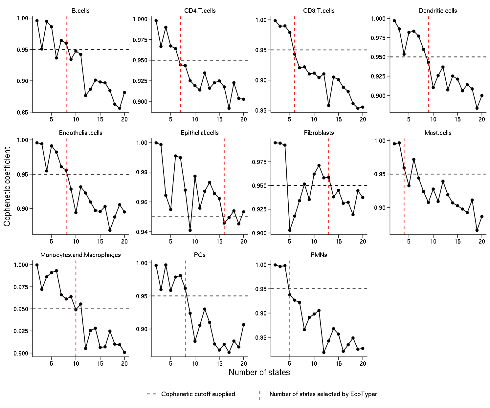
```


-   For each cell type, the following outputs, exemplified here for
    endothelial cells, are produced:

    -   Abundances of cell states remaining after the QC filters in
        steps 6 and 7 (if run), across samples in the discovery dataset:

``` r
data = read.delim("PresortedDiscoveryOutput/Endothelial.cells/state_abundances.txt")
dim(data)
```

    ## [1]   4 250

``` r
head(data[,1:5])
```

    ##     TCGA.37.A5EN.01A.21R.A26W.07 TCGA.37.4133.01A.01R.1100.07
    ## S01                 4.657038e-15                 3.396931e-15
    ## S02                 4.313475e-01                 3.396931e-15
    ## S03                 4.657038e-15                 3.396931e-15
    ## S04                 5.532795e-02                 3.396931e-15
    ##     TCGA.77.7465.01A.11R.2045.07 TCGA.34.5240.01A.01R.1443.07
    ## S01                 4.011227e-15                 3.955821e-15
    ## S02                 2.750005e-01                 8.143772e-02
    ## S03                 4.011227e-15                 3.955821e-15
    ## S04                 4.011227e-15                 1.748715e-03
    ##     TCGA.05.4249.01A.01R.1107.07
    ## S01                 4.256051e-15
    ## S02                 4.256051e-15
    ## S03                 1.137231e-01
    ## S04                 8.575277e-01

-   Assignment of samples in the discovery dataset to the cell state
    with the highest abundance. Only samples assigned to the cell states
    remaining after the QC filters in steps 6 and 7 (if run) are
    included. The remaining ones are considered unassigned and removed
    from this table:

``` r
data = read.delim("PresortedDiscoveryOutput/Endothelial.cells/state_assignment.txt")
dim(data)
```

    ## [1] 131   3

``` r
head(data)
```

    ##                              ID State InitialState
    ## 31 TCGA.55.6983.11A.01R.1949.07   S01         IS02
    ## 32 TCGA.44.6776.11A.01R.1858.07   S01         IS02
    ## 33 TCGA.77.7335.11A.01R.2045.07   S01         IS02
    ## 34 TCGA.38.A44F.01A.11R.A24H.07   S01         IS02
    ## 35 TCGA.77.7138.11A.01R.2045.07   S01         IS02
    ## 36 TCGA.44.6778.11A.01R.1858.07   S01         IS02

-   A heatmap illustrating the expression of genes used for cell state
    discovery, that have the highest fold-change in one of the cell
    states remaining after the QC filters in steps 6 and 7 (if run). In
    the current example, the heatmap includes in the top color bar two
    rows corresponding to *Tissue* and *Histology*, that have been
    provided in configuration file field *Annotation file column(s) to
    plot*, in addition to cell state labels always plotted:

``` r
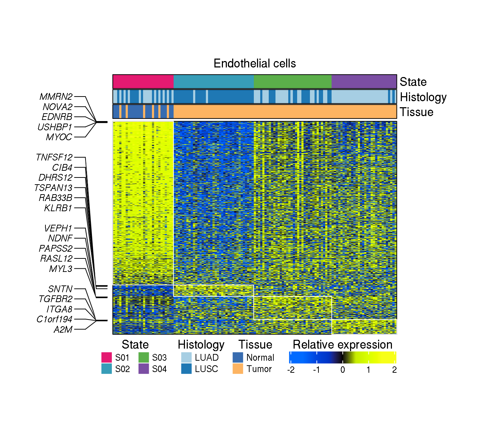
```


The ecotype output files include:

-   The cell state composition of each ecotype (the set of cell states
    making up each ecotype):

``` r
ecotypes = read.delim("PresortedDiscoveryOutput/Ecotypes/ecotypes.txt")
head(ecotypes[,c("CellType", "State", "Ecotype")])
```

    ##            CellType State Ecotype
    ## 1           B.cells   S01      E1
    ## 2 Endothelial.cells   S02      E1
    ## 3  Epithelial.cells   S01      E1
    ## 4       Fibroblasts   S07      E1
    ## 5           B.cells   S03      E2
    ## 6       CD4.T.cells   S02      E2

-   The number of initial clusters obtained by clustering the Jaccard
    index matrix, selected using the average silhouette:

``` r
knitr::include_graphics("PresortedDiscoveryOutput/Ecotypes/nclusters_jaccard.png")
```


-   A heatmap of the Jaccard index matrix, after filtering ecotypes with
    less than 3 cell states:

``` r
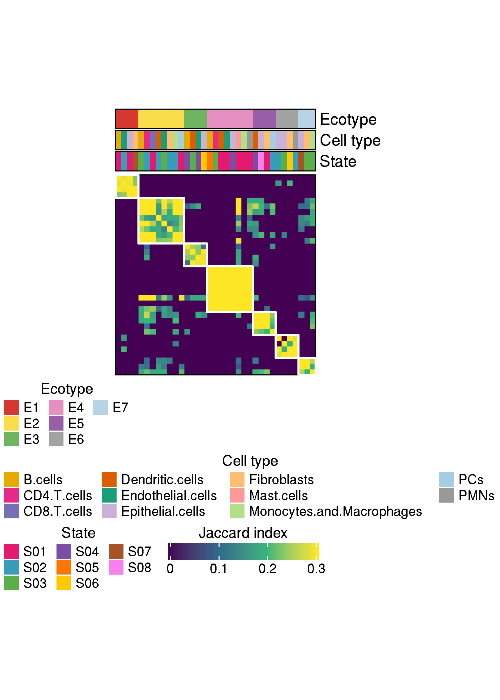
```


-   The abundance of each ecotype in each sample in the discovery
    dataset:

``` r
abundances = read.delim("PresortedDiscoveryOutput/Ecotypes/ecotype_abundance.txt")
dim(abundances)
```

    ## [1]   7 250

``` r
head(abundances[,1:5])
```

    ##    TCGA.37.A5EN.01A.21R.A26W.07 TCGA.37.4133.01A.01R.1100.07
    ## E1                  0.794531073                 5.587512e-02
    ## E2                  0.013996811                 7.309504e-02
    ## E3                  0.069214903                 6.880715e-03
    ## E4                  0.003306485                 6.049462e-03
    ## E5                  0.025837936                 1.759492e-14
    ## E6                  0.093112792                 8.580997e-01
    ##    TCGA.77.7465.01A.11R.2045.07 TCGA.34.5240.01A.01R.1443.07
    ## E1                 4.508978e-01                 9.485239e-01
    ## E2                 3.120952e-01                 2.957054e-03
    ## E3                 7.323729e-15                 1.835542e-03
    ## E4                 8.909708e-15                 1.377273e-02
    ## E5                 1.645593e-01                 7.296796e-15
    ## E6                 7.244779e-02                 3.291079e-02
    ##    TCGA.05.4249.01A.01R.1107.07
    ## E1                 4.493338e-09
    ## E2                 1.180982e-01
    ## E3                 5.358678e-01
    ## E4                 1.804165e-01
    ## E5                 8.538532e-02
    ## E6                 1.303634e-15

-   The assignment of samples in the discovery dataset to ecotypes. The
    samples not assigned to any ecotype are filtered out from this file:

``` r
assignments = read.delim("PresortedDiscoveryOutput/Ecotypes/ecotype_assignment.txt")
dim(assignments)
```

    ## [1] 190  11

``` r
head(assignments[,1:5])
```

    ##                                                        ID MaxEcotype
    ## TCGA.22.4613.01A.01R.1443.07 TCGA.22.4613.01A.01R.1443.07         E1
    ## TCGA.22.5471.01A.01R.1635.07 TCGA.22.5471.01A.01R.1635.07         E1
    ## TCGA.22.5473.01A.01R.1635.07 TCGA.22.5473.01A.01R.1635.07         E1
    ## TCGA.34.5240.01A.01R.1443.07 TCGA.34.5240.01A.01R.1443.07         E1
    ## TCGA.34.8456.01A.21R.2326.07 TCGA.34.8456.01A.21R.2326.07         E1
    ## TCGA.37.A5EM.01A.21R.A27Q.07 TCGA.37.A5EM.01A.21R.A27Q.07         E1
    ##                              AssignmentP AssignmentQ AssignedToEcotypeStates
    ## TCGA.22.4613.01A.01R.1443.07 0.006237509  0.02267708                    TRUE
    ## TCGA.22.5471.01A.01R.1635.07 0.011589892  0.03408792                    TRUE
    ## TCGA.22.5473.01A.01R.1635.07 0.173391227  0.21892832                    TRUE
    ## TCGA.34.5240.01A.01R.1443.07 0.073719200  0.12710207                    TRUE
    ## TCGA.34.8456.01A.21R.2326.07 0.002977868  0.01404655                    TRUE
    ## TCGA.37.A5EM.01A.21R.A27Q.07 0.027084554  0.06573921                    TRUE

-   A heatmap of cell state fractions across the samples assigned to
    ecotypes:

``` r
knitr::include_graphics("PresortedDiscoveryOutput/Ecotypes/heatmap_assigned_samples_viridis.png")
```


## Frequently asked questions

**Question**: How do I run EcoTyper on a high-performance cluster,
rather than a single server? <br/> **Answer**: EcoTyper can be modified
to run on a high-performance cluster, by overriding the
`pipeline\lib\multithreading.R` library. Currently the library provides
two functions, *PushToJobQueue* which adds a command line call to the
job queue, and *RunJobQueue* which waits for all the jobs in the queue
to finish. The default implementation of these functions uses R function
*mclapply* to perform computations on multiple threads:

``` r
job_queue = c()
PushToJobQueue <- function(cmd){
    job_queue <<- c(job_queue, cmd)
}

RunJobQueue <- function()
{
    if(length(job_queue) == 0)
    {
        return(NULL)
    }
    res = mclapply(job_queue, FUN = system, mc.cores = n_threads)
    job_queue <<- c()
    errors = sum(unlist(res))
    if(errors > 0)
    {
        stop("EcoTyper failed. Please check the error message above!")
    }
}
```

Users can re-write these two functions according to the requirements of
their cluster infrastructure. A primitive example of how this can be
achieved on a high performance cluster built on the SLURM infrastructure
is:

``` r
PushToJobQueue <- function(cmd){
    system(paste0("Rscript run_job.R ", cmd))
}

RunJobQueue <- function()
{   
    name_substr = discovery
    while(job_is_running(name_substr))
    {
        print("Sleeping 60s...") 
        Sys.sleep(60) 
    }
}

job_is_running <- function(name_substr)
{
    while(T)
    {
        possibleError <- tryCatch({
            out = system("squeue -o '%.18i\t%.9P\t%j\t%.8u\t%.8T\t%.10M\t%.9l\t%.6D\t%R'", intern = T)
            con <- textConnection(out)
            data <- read.delim(con) 
            if(ncol(data) < 9)
            {               
                Sys.sleep(30)
                next
            }           
            response = sum(grepl(name_substr, data[,3])) > 0
            return(response)
        }, error = function(e){})
        
        if(inherits(possibleError, "error"))
        {
            next
        }
    }   
}
```

Where `run_job.R` is a script that takes as input a command line and
submits the job to cluster:

``` r
template = '#!/bin/bash
#SBATCH --job-name=<TMP>
#SBATCH --begin=now
#SBATCH --time=3:00:00
#SBATCH --mem=30G 
#SBATCH -p normal  
#SBATCH -c 1
#SBATCH --error=../jobs/<R_SCRIPT_NAME>/<TMP>.err
#SBATCH --output=../jobs/<R_SCRIPT_NAME>/<TMP>.out

<R_SCRIPT> <ARGUMENTS> 
'
args <- commandArgs(T)
script_name = args[1]
arguments = args[-1]

output = file.path("../jobs", basename(script_name))
dir.create(output, recursive = T, showWarning = F)

arguments_s = ifelse(grepl("/", arguments, fixed = T), basename(arguments), arguments)
tmp = paste(arguments_s, collapse = "_") 

job = gsub("<R_SCRIPT>", script_name, template, fixed = T)
job = gsub("<R_SCRIPT_NAME>", basename(script_name), job, fixed = T)
job = gsub("<ARGUMENTS>", paste0(arguments, collapse = " "), job, fixed = T)
job = gsub("<TMP>", tmp, job, fixed = T)

output_path <- file.path(output, paste0(tmp, ".sh"))

write(job, output_path)

system(paste0("sbatch ", output_path))
```

    ## Warning in system(paste0("sbatch ", output_path)): error in running command
